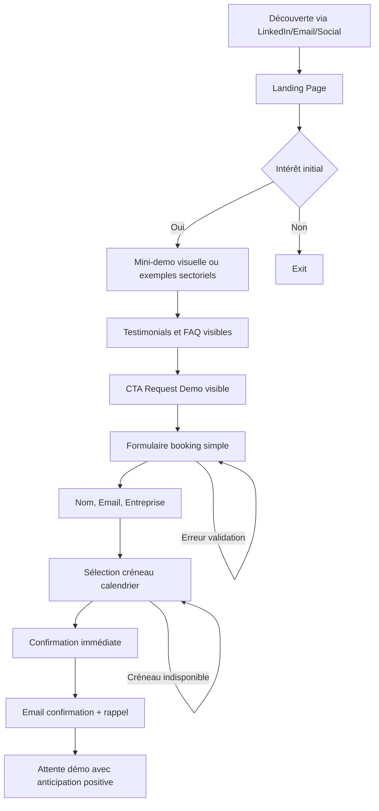
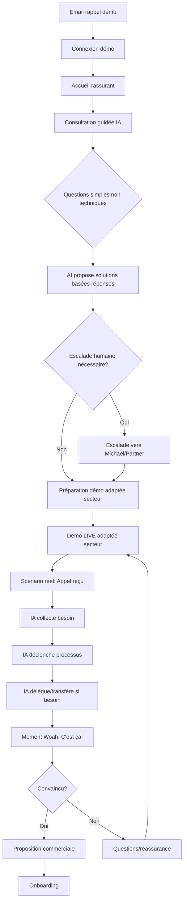
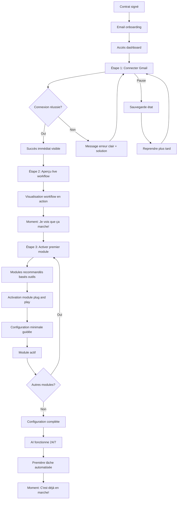
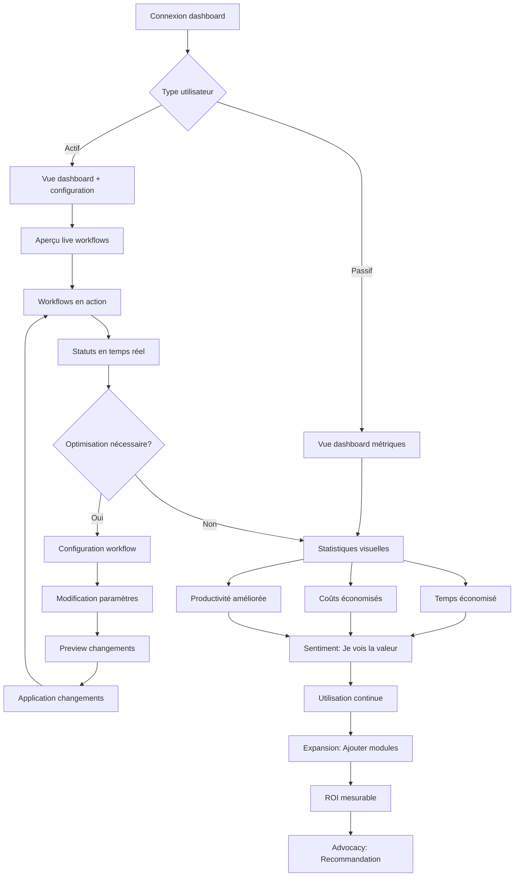

# UX Design Specification solo-aaa-agency

**Author:** Michael
**Date:** 2026-01-11

---

## Executive Summary

### Project Vision

solo-aaa-agency révolutionne l'accès des petites entreprises aux solutions IA en proposant une intégration personnalisée sans migration. Contrairement aux plateformes génériques, l'agence offre une consultation guidée par l'IA, des agents IA personnalisés et des solutions d'automatisation qui s'intègrent de manière transparente dans les outils et workflows existants. La vision centrale : "L'IA qui s'adapte à votre entreprise, pas l'inverse" - zéro migration requise, intégration transparente, et ROI qui libère le budget pour la croissance.

### Target Users

**Persona Principal : Sophie Martin (Propriétaire d'entreprise)**
- Propriétaire/directrice d'une petite entreprise (5-20 employés)
- Niveau technique faible - utilise occasionnellement ChatGPT mais ne comprend pas comment ça fonctionne
- Surmenée par les opérations quotidiennes, manque de temps pour apprendre de nouvelles technologies
- Besoin : Réduire les coûts opérationnels, améliorer la productivité, libérer du temps pour le travail stratégique
- Frustrations : Solutions IA génériques qui ne répondent pas aux besoins spécifiques, complexité technique, manque de temps pour comprendre et intégrer

**Persona Secondaire : Thomas Dubois (Membre d'équipe)**
- Membre d'équipe dans une petite entreprise (rôles variés : admin, vente, service client, opérations)
- Accès : Utilisateur licencié avec accès aux outils IA via dashboard
- Niveau technique : Variable (faible à intermédiaire)
- Types d'utilisateurs :
  - **Utilisateurs passifs** : Bénéficient de l'automatisation sans interaction directe (l'IA fonctionne en arrière-plan)
  - **Utilisateurs actifs** : Utilisent le dashboard pour configurer, personnaliser ou surveiller les workflows IA

### Key Design Challenges

1. **Réduction de l'anxiété technique** : Les utilisateurs cibles ont un niveau technique faible et sont submergés par le battage médiatique autour de l'IA. Le design doit être pédagogique, rassurant et visuel plutôt que technique.

2. **Démonstration de valeur immédiate** : Le moment "Woah" lors de la démo LIVE est critique. Le design doit permettre une démonstration claire et adaptée au secteur d'activité qui montre immédiatement comment l'IA résout leurs problèmes spécifiques.

3. **Complexité masquée, simplicité apparente** : L'intégration zéro migration implique une complexité technique en arrière-plan, mais l'interface utilisateur doit rester simple et intuitive. Le dashboard doit montrer la valeur sans exposer la complexité technique.

4. **Communication du ROI et de la libération budgétaire** : Les utilisateurs doivent comprendre clairement l'impact économique (20,000€-26,000€/an libérés par rôle automatisé). Le design doit rendre ces métriques visuelles et compréhensibles.

5. **Support de deux types d'utilisateurs** : Le design doit servir à la fois les utilisateurs passifs (qui bénéficient sans interaction) et les utilisateurs actifs (qui configurent via le dashboard), avec des parcours adaptés à chaque type.

6. **Équilibre rassurance sans infantilisation** : Les utilisateurs sont des professionnels compétents dans leur domaine mais novices en IA. Le design doit respecter leur expertise tout en les guidant avec confiance et pédagogie.

### Design Opportunities

1. **Expérience de consultation guidée** : Créer un processus de consultation guidé par l'IA qui se sente accessible et non intimidant, avec escalade humaine visible dès le départ. L'opportunité est de transformer l'anxiété en confiance à travers un design progressif et rassurant.

2. **Dashboard de métriques visuelles** : Concevoir un dashboard qui transforme les données complexes (temps économisé, économies de coûts, ROI) en visualisations intuitives et motivantes. L'opportunité est de créer un sentiment de réussite et de valeur mesurable.

3. **Démonstration interactive adaptative** : Concevoir une expérience de démo qui s'adapte au secteur d'activité du prospect et crée le moment "Woah" personnalisé. L'opportunité est de créer une connexion émotionnelle immédiate avec la valeur de la solution.

4. **Interface multi-niveaux d'engagement** : Créer une interface qui fonctionne pour les utilisateurs passifs (simple, automatique) tout en permettant aux utilisateurs actifs d'explorer et de personnaliser. L'opportunité est de servir deux audiences avec une seule interface élégante.

5. **Messaging positif et transformationnel** : Utiliser le design pour communiquer le message de "libération" et "réallocation" plutôt que "remplacement". L'opportunité est de créer une expérience qui élève émotionnellement les utilisateurs plutôt que de les faire se sentir remplacés.

6. **Booking de démo fluide et rassurant** : Concevoir un système de réservation de démo qui soit simple, transparent et rassurant. L'opportunité est de transformer le booking en première expérience positive qui réduit l'anxiété avant même la démo.

### Principes de Design Fondamentaux

**Basés sur les directives UX identifiées :**

1. **Simplicité et clarté absolues** : Interface épurée avec hiérarchie visuelle nette, langage simple sans jargon technique, microcopies rassurantes ("Nous vous guidons à chaque étape" plutôt que "Configuration requise").

2. **Rassurance sans infantilisation** : Ton professionnel et respectueux qui présente les informations comme des options, pas des obligations. Utiliser "Vous pouvez explorer à votre rythme" plutôt que "Suivez ces étapes obligatoires".

3. **Pédagogie avec assurances** : Combiner guidance pédagogique avec affirmations de confiance. Messages positifs : "Votre intégration est sécurisée" et "Notre équipe vous accompagne". Montrer la valeur avant la complexité.

4. **Choix, pas obligations** : Présenter les actions comme des possibilités ("Vous pouvez...") plutôt que des exigences ("Vous devez..."). Donner le contrôle à l'utilisateur tout en guidant subtilement.

5. **Clarté visuelle** : Espace blanc généreux, typographie lisible, couleurs apaisantes, indicateurs de progression clairs, messages de confirmation rassurants.

---

## Core User Experience

### Defining Experience

L'expérience centrale de solo-aaa-agency se concentre sur la **gestion clientèle automatisée** et la **satisfaction client (SAV)**. Les utilisateurs interagissent principalement avec le système pour :

- **Automatiser la communication client** : Répondeur automatique, emails automatiques, classification et analyse des interactions
- **Recueillir et comprendre les besoins clients** : Identifier les problèmes de leurs clients et proposer des solutions adaptées
- **Surveiller et optimiser** : Avoir un aperçu en live du fonctionnement de leurs workflows et consulter les statistiques de performance

L'expérience doit être centrée sur la **simplicité de configuration** et l'**intégration transparente** avec les outils existants (Gmail, Outlook, Slack, etc.), permettant aux utilisateurs de voir immédiatement la valeur de l'automatisation sans complexité technique.

**Découverte guidée des modules** : Les utilisateurs ne doivent pas simplement voir une liste de modules, mais recevoir des recommandations basées sur leurs outils connectés avec des explications visuelles : "Basé sur vos outils connectés, voici les modules recommandés".

**Visualisation animée de l'aperçu en live** : L'aperçu ne doit pas être juste des données, mais une visualisation du workflow en action - un diagramme animé montrant : Email reçu → Classifié → Réponse générée → Client satisfait. C'est là que l'utilisateur voit la valeur immédiatement.

**Progression par étapes avec succès immédiat** : La configuration doit suivre une progression claire : Étape 1 = Connecter un outil (Gmail), Étape 2 = Voir l'aperçu en live, Étape 3 = Activer le premier module. Chaque étape doit donner un sentiment de succès immédiat.

### Platform Strategy

**MVP : Application Web**
- Interface optimisée pour souris/clavier (pas de contraintes tactiles en MVP)
- Priorités de design : accessibilité, réactivité, performance de l'interface, intuitivité
- Offline : Support si nécessaire et simple à implémenter, mais pas dans le scope MVP
- Pas de capacités spécifiques aux appareils en MVP

**Considérations techniques :**
- Performance de l'interface critique pour l'expérience utilisateur
- Réactivité essentielle pour les aperçus en live et les statistiques en temps réel
- Accessibilité importante pour servir tous les niveaux techniques d'utilisateurs

**Architecture d'abstraction pour intégrations** : Une couche d'abstraction "Connecteur" uniforme masque la complexité des différentes APIs (Gmail, Outlook, Slack), présentant une interface cohérente à l'utilisateur.

### Effortless Interactions

**Interactions qui doivent être complètement naturelles :**

1. **Configuration et intégration** : L'intégration avec les outils existants (Gmail, Outlook, Slack, etc.) doit être simple et guidée, sans complexité technique apparente. Pour le MVP, focus sur une intégration excellente (Gmail) plutôt que plusieurs partiellement.

2. **Modules plug and play** : Les modules doivent s'intégrer facilement sans configurations complexes entre eux. Architecture modulaire avec interfaces claires et tests isolés.

3. **Aperçu en live** : Les utilisateurs doivent pouvoir voir en temps réel le fonctionnement de leurs workflows et consulter les statistiques sans effort. Utilisation de WebSockets pour les événements critiques (nouveau message client, réponse générée) et polling toutes les 2-3 secondes pour les statistiques.

4. **Élimination de la complexité** : Les configurations complexes entre modules doivent être éliminées ou automatisées. Chaque module doit être indépendant avec des interfaces claires.

**Problèmes actuels à résoudre :**
- Les solutions existantes sont trop compliquées à configurer
- Les intégrations entre outils nécessitent trop d'étapes techniques
- La compréhension du fonctionnement des workflows n'est pas immédiate

**Architecture asynchrone avec reprise** : La configuration peut s'étendre sur une journée, permettant à l'utilisateur de commencer, partir, et revenir plus tard. L'architecture sauvegarde l'état de configuration et permet la reprise : "Reprendre où vous vous êtes arrêté".

### Critical Success Moments

**Moments qui déterminent le succès ou l'échec de l'expérience :**

1. **Temps d'installation** : Le moment où l'utilisateur configure et active le système pour la première fois. Ce moment doit être rapide et rassurant, sans friction technique. **Métrique cible : 1 jour maximum pour la configuration complète (objectif long terme < 2 heures)**.

2. **Première interaction réussie** : Le moment où l'utilisateur voit l'IA interagir avec succès avec leurs clients (réponse automatique pertinente, email bien classé, besoin identifié correctement). **Latence cible : 300ms maximum pour l'aperçu en live (seuil d'imperceptibilité)**.

3. **Satisfaction client mesurable** : Le moment où l'utilisateur constate que leurs clients sont satisfaits et que l'efficacité de l'IA est démontrable (via statistiques et métriques).

4. **Interactions live réussies** : Le moment où les interactions en temps réel avec leurs clients fonctionnent parfaitement, créant confiance dans le système. Utilisation de temps réel (WebSockets) pour les événements critiques et polling pour les statistiques.

5. **Recueil de besoins efficace** : Le moment où le système identifie correctement les problèmes des clients et propose des solutions pertinentes, démontrant la valeur de l'automatisation.

**Parcours utilisateur critiques :**
- Recueil des besoins clients et identification de problèmes
- Gestion du SAV et satisfaction client
- Configuration initiale et intégration des outils (avec progression claire et indicateurs de temps estimé)
- Surveillance et optimisation via aperçu live et statistiques

**Métrique de succès principale : Temps d'installation** - C'est mesurable, actionnable, et directement lié à l'expérience utilisateur. Le design doit minimiser ce temps à chaque itération.

### Experience Principles

**Principes directeurs pour toutes les décisions UX :**

1. **Simplicité avant tout** : Chaque interaction doit être simple et intuitive, éliminant la complexité technique apparente

2. **Intégration transparente** : Les intégrations avec les outils existants doivent être fluides et guidées, sans exposer la complexité technique. Architecture d'abstraction uniforme masquant les différences d'APIs

3. **Visibilité immédiate** : Les utilisateurs doivent voir immédiatement la valeur et le fonctionnement de leurs workflows via aperçus en live animés et statistiques. Visualisation du workflow en action, pas juste des données

4. **Modules autonomes** : Les modules doivent fonctionner en plug and play, sans configurations complexes entre eux. Architecture modulaire avec interfaces claires

5. **Succès mesurable** : Chaque interaction doit contribuer à des résultats mesurables (satisfaction client, efficacité IA, temps économisé). Métrique principale : temps d'installation

6. **Performance et réactivité** : L'interface doit être performante et réactive pour supporter les aperçus en live et les statistiques en temps réel. Latence cible : 300ms maximum

7. **Accessibilité universelle** : Le design doit être accessible à tous les niveaux techniques, guidant sans infantiliser

8. **Progression guidée avec succès immédiat** : Chaque étape de configuration doit donner un sentiment de succès immédiat. Progression claire : Connecter → Voir → Activer

9. **Focus progressif MVP** : Priorités techniques pour le MVP avec focus progressif : Stabilité (semaine 1-2) → Rapidité (semaine 3-4) → Performance (semaine 5-6). Le design doit supporter cette progression avec des indicateurs de performance visibles

10. **Architecture asynchrone** : Support de la configuration étendue sur une journée avec sauvegarde d'état et reprise. Design pattern : "Reprendre où vous vous êtes arrêté"

---

## Desired Emotional Response

### Primary Emotional Goals

**1. Confiance et sécurité**
Les utilisateurs doivent se sentir en confiance à chaque étape, sachant que le système les guide et les informe constamment. Aucune action ne doit laisser l'utilisateur dans l'incertitude - chaque interaction doit avoir un retour visuel clair (statuts, indicateurs de progression, retours API visibles).

**2. Contrôle et personnalisation**
Les utilisateurs doivent sentir qu'ils contrôlent leur expérience grâce à la personnalisation (thème, animations, préférences). Cette capacité de personnalisation crée un sentiment de confort et d'appartenance.

**3. Instantanéité et fluidité**
Les utilisateurs doivent ressentir une interface "instantanée" grâce aux updates optimistes. Même si les boutons ne sont pas immédiatement réactifs côté serveur, l'interface doit donner l'impression de réagir immédiatement, créant un sentiment de fluidité et de réactivité.

**4. Plaisir et professionnalisme**
Les animations bien faites et l'attention aux détails créent un sentiment de qualité et de plaisir. L'utilisateur doit sentir qu'il utilise un produit soigné et professionnel.

**5. Absence d'anxiété**
L'utilisateur ne doit jamais se sentir perdu ou anxieux. Chaque état doit être clair, chaque erreur doit être expliquée de manière compréhensible (éviter les erreurs techniques par défaut comme "Next error"), et chaque action doit avoir un retour visuel.

### Emotional Journey Mapping

**Découverte du produit :**
- **Émotion désirée** : Curiosité positive, confiance initiale
- **Design** : Interface claire avec messages rassurants, pas de jargon technique

**Pendant la configuration/expérience centrale :**
- **Émotion désirée** : Contrôle, progression visible, confiance
- **Design** : Indicateurs de progression clairs, updates optimistes, personnalisation visible

**Après accomplissement d'une tâche :**
- **Émotion désirée** : Accomplissement, satisfaction, efficacité perçue
- **Design** : Confirmations visuelles, animations de succès, métriques visibles

**En cas d'erreur ou de problème :**
- **Émotion désirée** : Confiance maintenue, compréhension, pas d'anxiété
- **Design** : Messages d'erreur clairs et compréhensibles (pas d'erreurs techniques brutes), suggestions de solutions, statuts visibles

**Retour/utilisation répétée :**
- **Émotion désirée** : Familiarité, confort, efficacité
- **Design** : Personnalisation mémorisée, raccourcis, interface adaptée aux préférences

### Micro-Emotions

**États émotionnels critiques à favoriser :**

1. **Confiance** (vs Confusion) : Toujours des indications claires, statuts visibles, retours API explicites
2. **Contrôle** (vs Perte de contrôle) : Personnalisation (thème, animations), choix utilisateur respectés
3. **Fluidité** (vs Frustration) : Updates optimistes pour interface "instantanée", animations fluides
4. **Sécurité** (vs Anxiété) : Gestion d'erreurs complète, messages compréhensibles, rien laissé au hasard
5. **Plaisir** (vs Satisfaction basique) : Animations bien faites, attention aux détails, expérience soignée

**États émotionnels à éviter :**

- Confusion : Pas d'indications, statuts manquants
- Frustration : Boutons non réactifs, délais visibles
- Anxiété : Erreurs non gérées, messages techniques bruts
- Perte de contrôle : Pas de personnalisation, pas de choix

### Design Implications

**Pour créer confiance et sécurité :**
- Toujours afficher des statuts clairs pour chaque action (loading, success, error)
- Afficher les retours API de manière compréhensible (pas d'erreurs techniques brutes)
- Gérer toutes les erreurs avec des messages explicites et des suggestions
- Éviter absolument les erreurs par défaut (comme "Next error") - toujours personnaliser les messages d'erreur
- Indicateurs visuels pour chaque état : en attente, en cours, terminé, erreur

**Pour créer contrôle et personnalisation :**
- Options de personnalisation visibles (thème, animations, préférences)
- Respecter les choix utilisateur et les mémoriser
- Interface adaptative selon les préférences
- Sentiment que l'utilisateur "possède" son expérience

**Pour créer instantanéité et fluidité :**
- Updates optimistes : l'interface réagit immédiatement avant confirmation serveur
- Animations fluides pour masquer les délais réseau
- Feedback visuel immédiat sur chaque interaction
- Transitions douces entre les états

**Pour créer plaisir et professionnalisme :**
- Animations bien faites et subtiles aux moments clés (succès, transitions importantes)
- Attention aux détails visuels (micro-interactions, états hover, focus)
- Qualité visuelle cohérente et soignée
- Expérience qui se sent "premium" sans être ostentatoire

**Pour éviter l'anxiété :**
- Jamais laisser l'utilisateur sans indications
- Toujours afficher un statut (même si c'est "en cours de traitement")
- Messages d'erreur compréhensibles avec contexte et solutions
- Gestion proactive des erreurs réseau, timeout, etc.

### Emotional Design Principles

**Principes directeurs pour le design émotionnel :**

1. **Transparence totale** : L'utilisateur doit toujours savoir où il en est, ce qui se passe, et ce qui va se passer. Aucun état caché ou ambigu.

2. **Réactivité perçue** : L'interface doit toujours donner l'impression de réagir instantanément, même si les opérations backend prennent du temps. Updates optimistes et animations pour masquer la latence.

3. **Personnalisation visible** : Les préférences utilisateur (thème, animations) doivent être visibles et impactantes, créant un sentiment de contrôle et de confort.

4. **Gestion d'erreurs empathique** : Toutes les erreurs doivent être expliquées en langage utilisateur, avec contexte et suggestions de solutions. Jamais d'erreurs techniques brutes.

5. **Animations intentionnelles** : Les animations doivent servir un but (masquer la latence, célébrer le succès, guider l'attention) et être bien exécutées. Pas d'animations décoratives qui ralentissent.

6. **Feedback constant** : Chaque action doit avoir un retour visuel immédiat. Statuts, indicateurs, confirmations - rien ne doit être silencieux.

7. **Cohérence émotionnelle** : L'expérience doit maintenir un ton émotionnel cohérent (confiant, rassurant, professionnel) à travers tous les états et interactions.

8. **Prévention de l'anxiété** : Anticiper les moments d'anxiété potentielle (chargement, erreurs, états incertains) et les gérer proactivement avec des messages rassurants et des indicateurs clairs.

---

## UX Pattern Analysis & Inspiration

### Inspiring Products Analysis

**Approche : Meilleures pratiques UX/UI modernes**
Plutôt que de se baser sur des applications spécifiques, cette analyse s'appuie sur les meilleures pratiques UX/UI modernes et les dernières technologies pour créer une expérience utilisateur optimale.

**Standards de l'industrie analysés :**
- Design Systems modernes (Material Design, Ant Design, Tailwind UI)
- Patterns d'interaction contemporains
- Technologies frontend récentes (React/Next.js, TypeScript, Tailwind CSS)
- Standards d'accessibilité (WCAG 2.1+)
- Principes de performance web moderne

### Transferable UX Patterns

**1. Design Systems et composants réutilisables**
- **Pattern** : Systèmes de design cohérents avec composants réutilisables
- **Application pour solo-aaa-agency** : Composants réutilisables pour garantir cohérence et rapidité de développement
- **Bénéfice** : Interface cohérente, maintenance simplifiée, développement accéléré

**2. Dark Mode et personnalisation**
- **Pattern** : Thèmes clair/sombre avec préférences utilisateur mémorisées
- **Application pour solo-aaa-agency** : Personnalisation du thème pour le confort visuel, aligné avec l'objectif de contrôle utilisateur
- **Bénéfice** : Confort utilisateur, réduction de la fatigue oculaire, sentiment de contrôle

**3. Micro-interactions et animations subtiles**
- **Pattern** : Animations intentionnelles avec bibliothèques modernes (Framer Motion, React Spring)
- **Application pour solo-aaa-agency** : Feedback visuel immédiat, transitions fluides, célébrations de succès
- **Bénéfice** : Interface perçue comme réactive, plaisir d'utilisation, guidage de l'attention

**4. Updates optimistes (Optimistic UI)**
- **Pattern** : Mise à jour immédiate de l'UI avant confirmation serveur
- **Application pour solo-aaa-agency** : Interface "instantanée" même avec latence réseau, essentiel pour l'expérience fluide
- **Bénéfice** : Perceived performance élevée, réduction de la frustration, sentiment d'instantanéité

**5. États de chargement et skeletons**
- **Pattern** : Skeleton screens au lieu de spinners génériques
- **Application pour solo-aaa-agency** : Indicateurs de chargement contextuels et informatifs pour workflows et statistiques
- **Bénéfice** : Réduction de l'anxiété, meilleure perception du temps de chargement, toujours des indications visibles

**6. Gestion d'erreurs empathique**
- **Pattern** : Messages d'erreur clairs avec contexte et solutions suggérées
- **Application pour solo-aaa-agency** : Messages personnalisés, jamais d'erreurs techniques brutes (éviter "Next error")
- **Bénéfice** : Confiance maintenue, réduction de l'anxiété, guidance claire

**7. Progressive Disclosure**
- **Pattern** : Révéler l'information progressivement selon le besoin
- **Application pour solo-aaa-agency** : Configuration par étapes, informations avancées masquées par défaut
- **Bénéfice** : Réduction de la surcharge cognitive, onboarding progressif, configuration sur une journée supportée

**8. Real-time updates avec WebSockets**
- **Pattern** : Mises à jour en temps réel pour données critiques
- **Application pour solo-aaa-agency** : Aperçu en live des workflows, notifications instantanées, latence < 300ms
- **Bénéfice** : Expérience immersive, sentiment de connexion en direct, valeur immédiate visible

**9. Accessibilité moderne (WCAG 2.1+)**
- **Pattern** : Contraste élevé, navigation clavier, ARIA labels, focus visible
- **Application pour solo-aaa-agency** : Interface accessible à tous les niveaux techniques, guidant sans infantiliser
- **Bénéfice** : Inclusion, meilleure UX pour tous, conformité légale

**10. Mobile-first responsive design**
- **Pattern** : Design adaptatif avec breakpoints modernes (mobile, tablette, desktop)
- **Application pour solo-aaa-agency** : Interface responsive même si MVP web desktop-first, préparation pour mobile future
- **Bénéfice** : Expérience cohérente sur tous les appareils, préparation mobile future

### Technologies Modernes et Patterns Techniques

**Stack Frontend Moderne :**
- **React/Next.js** : Server Components pour performance, Streaming pour chargement progressif, Optimistic UI natif
- **TypeScript** : Type safety pour réduire les erreurs et améliorer la maintenabilité
- **Tailwind CSS** : Utility-first pour développement rapide et cohérent, personnalisation facile
- **Framer Motion** : Animations performantes et fluides, support des micro-interactions
- **React Query/SWR** : Gestion d'état serveur avec cache intelligent, updates optimistes, retry automatique

**Patterns Techniques Modernes :**
- **Server-Side Rendering (SSR)** : Performance initiale et SEO optimaux
- **Static Site Generation (SSG)** : Pages statiques ultra-rapides pour contenu stable
- **Incremental Static Regeneration (ISR)** : Contenu dynamique avec performance statique
- **Edge Computing** : Latence réduite pour les API, support des WebSockets en temps réel

### Anti-Patterns to Avoid

**1. Spinners génériques sans contexte**
- **Problème** : Spinners sans indication créent de l'anxiété et de la confusion
- **Solution** : Skeleton screens ou indicateurs contextuels avec messages informatifs ("Chargement de vos workflows...")

**2. Erreurs techniques brutes**
- **Problème** : Messages d'erreur techniques incompréhensibles (ex: "Next error", stack traces)
- **Solution** : Messages en langage utilisateur avec contexte et solutions suggérées ("Impossible de se connecter à Gmail. Vérifiez vos identifiants ou réessayez dans quelques instants.")

**3. États vides sans guidance**
- **Problème** : Pages vides sans indication de ce qui va se passer ou comment commencer
- **Solution** : États vides avec messages encourageants et actions suggérées ("Commencez par connecter votre premier outil")

**4. Surcharge cognitive**
- **Problème** : Trop d'informations affichées simultanément, interface écrasante
- **Solution** : Progressive disclosure, hiérarchie visuelle claire, informations avancées masquées par défaut

**5. Absence de feedback**
- **Problème** : Actions sans retour visuel immédiat, utilisateur incertain de ce qui se passe
- **Solution** : Feedback immédiat sur chaque interaction (hover states, click feedback, loading states)

**6. Navigation confuse**
- **Problème** : Structure de navigation non intuitive, utilisateur perdu
- **Solution** : Navigation claire avec breadcrumbs, menus contextuels, indicateurs de position

**7. Performance perçue faible**
- **Problème** : Délais visibles même si backend rapide, interface qui se sent lente
- **Solution** : Updates optimistes, animations de transition, skeleton screens, feedback immédiat

**8. Personnalisation invisible**
- **Problème** : Préférences utilisateur non visibles ou non impactantes
- **Solution** : Personnalisation visible (thème, animations), mémorisation des choix, interface adaptative

### Design Inspiration Strategy

**À adopter directement :**

1. **Updates optimistes** : Aligne parfaitement avec votre besoin d'interface "instantanée" et réactivité perçue
2. **Gestion d'erreurs empathique** : Correspond exactement à votre objectif de confiance et sécurité, éviter les erreurs techniques brutes
3. **Dark mode et personnalisation** : Supporte votre objectif de contrôle utilisateur et confort
4. **Micro-interactions fluides** : Crée le plaisir et professionnalisme désiré avec animations bien faites
5. **Real-time updates** : Essentiel pour l'aperçu en live des workflows avec latence < 300ms
6. **Skeleton screens** : Répond au besoin de toujours avoir des indications visibles, jamais laisser l'utilisateur sans statut

**À adapter pour votre contexte :**

1. **Progressive Disclosure** : Adapter pour la configuration multi-étapes sur une journée avec sauvegarde d'état et reprise
2. **Design System** : Créer un système adapté à votre MVP avec possibilité d'évolution, composants réutilisables pour cohérence
3. **Responsive Design** : MVP desktop-first mais avec structure responsive pour préparation mobile future
4. **Accessibilité** : Adapter pour servir tous les niveaux techniques sans infantiliser, guidance pédagogique avec assurances

**À éviter :**

1. **Complexité technique visible** : Ne pas exposer les détails d'intégration API, masquer la complexité backend
2. **Onboarding trop long** : Éviter les tutoriels interminables, préférer la découverte progressive
3. **Animations excessives** : Garder les animations intentionnelles (masquer latence, célébrer succès), pas d'animations décoratives qui ralentissent
4. **Patterns non adaptés** : Éviter les patterns complexes qui ne servent pas les objectifs de simplicité et clarté

---

## Design System Foundation

### Design System Choice

**Stack technique sélectionné :**
- **Next.js** : Framework React avec Server Components, SSR, et optimisations de performance
- **Tailwind CSS** : Utility-first CSS pour développement rapide et cohérent
- **shadcn/ui** : Composants React accessibles et personnalisables basés sur Radix UI
- **Vercel AI SDK** : SDK pour intégration d'IA avec streaming et optimisations
- **AI Elements** : Composants UI spécialisés pour les interfaces IA (compatible shadcn/ui)
- **Autres librairies compatibles shadcn** : Écosystème extensible de composants accessibles

### Rationale for Selection

**Pourquoi cette stack est idéale pour solo-aaa-agency :**

1. **Cohérence avec les besoins MVP** :
   - Next.js offre SSR/SSG pour performance optimale
   - Tailwind CSS permet développement rapide avec personnalisation facile (thème, dark mode)
   - shadcn/ui fournit composants accessibles sans dépendances lourdes

2. **Personnalisation et contrôle** :
   - Tailwind config permet personnalisation complète du thème (couleurs, espacements, typographie)
   - shadcn/ui utilise des composants copiables dans le projet (pas de dépendance externe)
   - Contrôle total sur chaque composant pour adaptation aux besoins spécifiques

3. **Support des fonctionnalités IA** :
   - Vercel AI SDK optimisé pour streaming et temps réel (essentiel pour aperçu live < 300ms)
   - AI Elements fournit composants spécialisés pour interfaces IA (chat, streaming, etc.)
   - Intégration native avec Next.js et React Server Components

4. **Performance et accessibilité** :
   - Next.js optimise automatiquement les performances (code splitting, image optimization)
   - shadcn/ui basé sur Radix UI garantit accessibilité WCAG 2.1+
   - Tailwind CSS génère CSS optimisé et minimal

5. **Développement rapide** :
   - Composants prêts à l'emploi avec shadcn/ui
   - Utility classes Tailwind pour styling rapide
   - TypeScript natif pour type safety

6. **Écosystème extensible** :
   - Compatibilité avec autres librairies shadcn (form handling, data tables, etc.)
   - Communauté active et documentation excellente
   - Facile d'ajouter de nouveaux composants selon les besoins

### Implementation Approach

**Structure du Design System :**

1. **Configuration Tailwind** :
   - Thème personnalisé avec couleurs de marque
   - Support dark mode natif
   - Breakpoints responsive pour desktop-first MVP
   - Animations personnalisées pour micro-interactions

2. **Composants shadcn/ui de base** :
   - Button, Input, Card, Dialog, Dropdown, etc.
   - Tous les composants copiés dans `/components/ui/`
   - Personnalisation via Tailwind classes et CSS variables

3. **Composants IA spécialisés** :
   - Utilisation d'AI Elements pour composants chat, streaming, etc.
   - Intégration Vercel AI SDK pour backend IA
   - Composants custom pour aperçu live des workflows

4. **Design Tokens** :
   - Couleurs : Palette cohérente avec variantes light/dark
   - Typographie : Hiérarchie claire et lisible
   - Espacements : Système cohérent (4px base)
   - Animations : Durées et easing standards

5. **Composants custom** :
   - Composants spécifiques au domaine (workflow cards, statuts, métriques)
   - Basés sur shadcn/ui mais adaptés aux besoins métier
   - Réutilisables et documentés

### Customization Strategy

**Personnalisation du thème :**

1. **Thème clair/sombre** :
   - Variables CSS pour couleurs (compatible shadcn/ui)
   - Toggle utilisateur avec mémorisation préférence
   - Transition fluide entre thèmes

2. **Animations personnalisées** :
   - Animations Tailwind pour transitions
   - Framer Motion pour animations complexes (workflow live, célébrations)
   - Durées optimisées pour perceived performance

3. **Composants adaptés** :
   - Personnalisation des composants shadcn/ui via Tailwind
   - Ajout de variants selon besoins (sizes, colors, states)
   - Composants métier construits sur base shadcn/ui

4. **Accessibilité maintenue** :
   - Tous les composants gardent accessibilité Radix UI
   - Tests d'accessibilité pour nouveaux composants
   - Support navigation clavier et screen readers

**Évolution du système :**

- Design system évolutif : facile d'ajouter composants selon besoins
- Documentation des composants custom
- Guidelines d'utilisation pour maintenir cohérence
- Possibilité d'étendre avec autres librairies compatibles shadcn

### Integration avec Stack Technique

**Next.js + TypeScript** :
- Server Components pour performance
- Type safety pour tous les composants
- API Routes pour backend
- Optimizations automatiques (images, fonts, etc.)

**Vercel AI SDK + AI Elements** :
- Streaming pour aperçu live workflows
- Composants UI spécialisés pour interfaces IA
- Intégration seamless avec composants shadcn/ui
- Support temps réel avec latence < 300ms

**Tailwind CSS** :
- Configuration centralisée pour cohérence
- Dark mode natif
- Responsive design pour préparation mobile future
- Purge CSS automatique pour bundle minimal

**shadcn/ui + écosystème** :
- Composants accessibles par défaut
- Personnalisation facile via Tailwind
- Extensibilité avec autres librairies compatibles
- Maintenance simplifiée (composants dans le projet)

---

## 2. Core User Experience

### 2.1 Defining Experience

**Expérience centrale identifiée :**
L'expérience centrale de solo-aaa-agency se concentre sur la **gestion clientèle automatisée** et la **satisfaction client (SAV)**. L'interaction principale que les utilisateurs décrivent à leurs amis serait : *"Voir l'IA gérer automatiquement leurs clients en temps réel"* ou *"Configurer une automatisation et voir immédiatement qu'elle fonctionne"*.

**Actions principales :**
- Automatiser la communication client (répondeur automatique, emails automatiques, classification)
- Recueillir et comprendre les besoins clients (identifier problèmes, proposer solutions)
- Surveiller et optimiser via aperçu en live des workflows et statistiques

**Expérience définie par :**
- Simplicité de configuration et intégration transparente
- Aperçu en live avec visualisation animée du workflow en action
- Progression par étapes avec succès immédiat à chaque étape

**⚠️ À approfondir :**
- Formulation exacte de l'expérience centrale "en une phrase"
- Interaction spécifique qui crée le moment "Woah"
- Métaphore ou comparaison qui aide les utilisateurs à comprendre rapidement

### 2.2 User Mental Model

**Modèle mental identifié :**
Les utilisateurs sont des professionnels compétents dans leur domaine mais novices en IA. Ils apportent un modèle mental de "gestion clientèle manuelle" qu'ils veulent transformer en "gestion automatisée".

**Attentes identifiées :**
- Intégration sans migration (zéro migration)
- Configuration simple et guidée (pas de complexité technique visible)
- Résultats visibles immédiatement (aperçu en live)

**Frustrations actuelles avec solutions existantes :**
- Solutions trop compliquées à configurer
- Intégrations nécessitant trop d'étapes techniques
- Compréhension du fonctionnement des workflows pas immédiate

**⚠️ À approfondir :**
- Comment les utilisateurs résolvent actuellement ce problème manuellement
- Quels raccourcis ou workarounds ils utilisent
- Ce qui rend les solutions existantes "magiques" ou "terribles" selon eux
- Où ils risquent d'être confus ou frustrés dans le processus

### 2.3 Success Criteria

**Critères de succès établis :**

1. **Temps d'installation** : 1 jour maximum (objectif long terme < 2 heures)
   - Métrique principale de succès
   - Design doit minimiser ce temps à chaque itération

2. **Latence aperçu en live** : 300ms maximum (seuil d'imperceptibilité)
   - Interface doit se sentir "instantanée"
   - WebSockets pour événements critiques, polling pour statistiques

3. **Première interaction réussie** : Utilisateur voit l'IA interagir avec succès avec leurs clients
   - Réponse automatique pertinente
   - Email bien classé
   - Besoin identifié correctement

4. **Satisfaction client mesurable** : Utilisateur constate que leurs clients sont satisfaits
   - Efficacité de l'IA démontrable via statistiques
   - Métriques visibles et compréhensibles

**Indicateurs de succès :**
- Utilisateur dit "ça marche" ou "c'est exactement ce dont j'avais besoin"
- Sentiment de contrôle et de compréhension
- Confiance dans le système après première utilisation

**⚠️ À approfondir :**
- Feedback spécifique qui indique le succès à chaque étape
- Ce qui fait que les utilisateurs se sentent "intelligents" ou "accomplis"
- Ce qui devrait se passer automatiquement sans intervention

### 2.4 Novel UX Patterns

**Analyse des patterns :**

**Patterns établis utilisés :**
- Configuration guidée par étapes (pattern familier)
- Dashboard avec métriques (pattern familier)
- Intégration d'outils via OAuth (pattern familier)

**Innovation dans les patterns familiers :**
- **Aperçu en live animé** : Visualisation du workflow en action (Email reçu → Classifié → Réponse générée → Client satisfait) plutôt que juste des données statiques
- **Découverte guidée des modules** : Recommandations basées sur outils connectés plutôt que simple liste
- **Configuration asynchrone** : Support configuration sur une journée avec reprise plutôt que processus linéaire

**Patterns potentiellement nouveaux nécessitant éducation :**
- Concept de "modules plug and play" pour automatisation
- Visualisation en temps réel des workflows automatisés
- Architecture d'abstraction masquant la complexité des intégrations

**⚠️ À approfondir :**
- Quels patterns nécessitent vraiment une éducation utilisateur
- Quelles métaphores peuvent aider à comprendre les concepts nouveaux
- Comment enseigner les patterns nouveaux sans surcharger l'utilisateur

### 2.5 Experience Mechanics

**Mécaniques de l'expérience centrale définies :**

**1. Initiation :**
- **Déclencheur** : Besoin de gérer clientèle plus efficacement
- **Point d'entrée** : Consultation guidée par l'IA ou booking de démo
- **Première action** : Connecter un outil (Gmail pour MVP)

**2. Interaction :**
- **Actions utilisateur** :
  - Connecter outils existants (Gmail, Outlook, Slack)
  - Activer modules recommandés
  - Surveiller aperçu en live
  - Consulter statistiques
- **Réponse système** :
  - Aperçu en live immédiat (< 300ms)
  - Visualisation animée du workflow
  - Statistiques en temps réel
  - Confirmations visuelles à chaque étape

**3. Feedback :**
- **Indicateurs de succès** :
  - Aperçu en live montrant workflow fonctionnel
  - Statistiques de performance visibles
  - Confirmations visuelles (animations de succès)
  - Messages rassurants à chaque étape
- **Gestion d'erreurs** :
  - Messages clairs et compréhensibles (pas d'erreurs techniques brutes)
  - Suggestions de solutions
  - Statuts visibles pour chaque action

**4. Complétion :**
- **Résultat de succès** : Système fonctionnel avec workflows automatisés actifs
- **Prochaine étape** : Surveillance continue, optimisation, ajout de modules supplémentaires
- **Sentiment désiré** : Accomplissement, confiance, efficacité perçue

**⚠️ À approfondir :**
- Détails spécifiques de chaque étape de l'interaction
- Contrôles et inputs exacts utilisés
- Feedback spécifique pour chaque type d'action
- Flow détaillé de l'initiation à la complétion

### Notes pour approfondissement futur

Cette section capture l'état actuel de la définition de l'expérience centrale basée sur les discussions précédentes. Les zones marquées "⚠️ À approfondir" nécessitent plus de clarification à travers :
- Tests utilisateurs avec prototypes
- Interviews avec utilisateurs cibles
- Analyse de produits similaires
- Itérations de design basées sur feedback

L'expérience centrale continue d'évoluer et sera affinée au fur et à mesure du développement et des retours utilisateurs.

---

## Visual Design Foundation

### Color System

**Palette principale inspirée de Nebula :**
- **Background principal** : Noir (#000000) ou gris très foncé (#0A0A0A, #1A1A1A)
- **Cartes/Conteneurs** : Gris foncé (#1A1A1A, #2C2C2C) avec ombres subtiles pour profondeur
- **Texte principal** : Blanc (#FFFFFF) pour titres et données importantes
- **Texte secondaire** : Gris clair (#A0A0A0, #64748B) pour descriptions et labels

**Couleurs d'accent :**
- **Orange primaire** : #E07B39 / #F97316 (Tailwind orange-500) pour boutons CTA, icônes actives, indicateurs positifs, graphiques
- **Vert** : #10B981 (Tailwind green-500) pour statuts "synced"/"actif", indicateurs de succès
- **Gradient boutons CTA** : Orange (#E07B39) vers brun foncé pour effet visuel subtil

**Mapping sémantique des couleurs :**
- **Primary** : Orange (#F97316) - Actions principales, CTA
- **Secondary** : Gris clair (#64748B) - Éléments secondaires
- **Success** : Vert (#10B981) - Confirmations, statuts positifs
- **Warning** : Orange/Ambre (#F59E0B) - Avertissements
- **Error** : Rouge (#EF4444) - Erreurs (à utiliser avec parcimonie)
- **Background** : Noir (#000000) - Fond principal
- **Surface** : Gris foncé (#1A1A1A) - Cartes, conteneurs
- **Text Primary** : Blanc (#FFFFFF) - Titres, texte important
- **Text Secondary** : Gris clair (#A0A0A0) - Descriptions, labels

**Mode sombre :** Entièrement dark mode par défaut, optimisé pour confort visuel et professionnalisme

**Accessibilité :**
- Contraste élevé blanc/noir (WCAG AAA)
- Vérification contraste orange sur noir pour texte (utiliser orange plus foncé si nécessaire)
- Tous les ratios de contraste conformes WCAG 2.1 AA minimum

### Typography System

**Famille de polices :**
- **Police principale** : Sans-serif moderne (Inter, Geist, ou système - `font-sans`)
- **Style** : Moderne, propre, très lisible sur fond sombre
- **Fallback** : System fonts (San Francisco, Segoe UI, Roboto)

**Hiérarchie typographique :**
- **H1 - Titres principaux** : `text-5xl` ou `text-6xl`, `font-bold`, blanc
  - Exemple : "Scale your protocol with smart infrastructure"
- **H2 - Sous-titres** : `text-3xl` ou `text-4xl`, `font-bold`, blanc
  - Exemple : "Manage keys, metrics, and networks in one place"
- **H3 - Titres de section** : `text-xl` ou `text-2xl`, `font-semibold`, blanc
  - Exemple : "Global routing", "UPTIME", "LATENCY"
- **Body - Texte principal** : `text-base`, `font-normal`, gris clair (#A0A0A0)
  - Exemple : Descriptions, contenu principal
- **Small - Labels** : `text-sm`, `font-normal`, gris clair (#64748B)
  - Exemple : Labels de formulaire, métadonnées

**Hauteurs de ligne :**
- Titres : `leading-tight` ou `leading-none` pour impact visuel
- Body : `leading-relaxed` pour lisibilité
- Labels : `leading-normal`

**Espacement typographique :**
- Espacement généreux entre sections : `mb-8`, `mb-12`, `mb-16`
- Padding interne des cartes : `p-6`, `p-8`, `p-12`

### Spacing & Layout Foundation

**Système d'espacement :**
- **Unité de base** : 4px (standard Tailwind CSS)
- **Échelle** : Utilisation de l'échelle Tailwind standard (4, 8, 12, 16, 24, 32, 48, 64, 96px)

**Padding et marges :**
- **Padding cartes** : `p-6` (24px), `p-8` (32px), `p-12` (48px) selon importance
- **Marges sections** : `mb-8` (32px), `mb-12` (48px), `mb-16` (64px)
- **Espacement interne** : `gap-4` (16px), `gap-6` (24px), `gap-8` (32px) pour grilles

**Mise en page :**
- **Layout** : Centré ou aligné à gauche selon contexte
- **Grille** : Système de grille flexible 12 colonnes pour desktop
- **Densité** : Faible densité, priorité à clarté et lisibilité
- **Espace blanc** : Utilisation généreuse de l'espace sombre pour aération

**Breakpoints responsive (Tailwind) :**
- `sm`: 640px (mobile)
- `md`: 768px (tablette)
- `lg`: 1024px (desktop - MVP focus)
- `xl`: 1280px (large desktop)
- `2xl`: 1536px (extra large)

**Structure de layout :**
- Container max-width : `max-w-7xl` pour contenu principal
- Padding horizontal : `px-4` mobile, `px-6` tablette, `px-8` desktop

### Visual Elements & Components

**Coins arrondis (Rounded corners) :**
- **Cartes principales** : `rounded-xl` (12px) pour cartes importantes
- **Cartes secondaires** : `rounded-lg` (8px) pour cartes standard
- **Boutons** : `rounded-lg` (8px) pour boutons standards, `rounded-full` pour boutons pill
- **Inputs** : `rounded-lg` (8px)
- **Badges/Tags** : `rounded-full` pour badges, `rounded-md` (6px) pour tags

**Boutons :**
- **CTA Principal** : Gradient orange (#E07B39) vers brun foncé, texte blanc, `rounded-lg`, `px-6 py-3`
- **Secondaire** : Fond gris foncé (#1A1A1A), texte blanc, bordure subtile, `rounded-lg`
- **Tertiaire** : Fond transparent, texte blanc avec bordure, `rounded-lg`
- **Taille minimale** : 44x44px pour zone de touch accessible

**Icônes :**
- **Style** : Simple, monochromatique, moderne
- **Couleurs** : Blanc pour éléments standards, orange pour éléments actifs/importants, vert pour statuts positifs
- **Taille** : `w-5 h-5` (20px) standard, `w-6 h-6` (24px) pour icônes importantes

**Ombres et profondeur :**
- **Cartes** : `shadow-lg` avec opacité faible pour profondeur subtile
- **Esthétique** : Plate avec légère élévation, pas d'ombres fortes
- **Effet** : Cartes légèrement élevées au-dessus du fond noir

**Gradients :**
- **Boutons CTA** : Gradient horizontal orange (#E07B39) vers brun foncé
- **Background optionnel** : Gradient vertical subtil violet foncé vers bleu foncé sur les bords (effet décoratif discret)

**États interactifs :**
- **Hover** : Légère élévation ou changement de couleur (orange plus clair)
- **Focus** : Bordure orange ou outline visible pour accessibilité
- **Active** : État pressé avec légère réduction d'opacité
- **Disabled** : Opacité réduite, curseur not-allowed

### Accessibility Considerations

**Contraste des couleurs :**
- Blanc sur noir : Ratio très élevé (conforme WCAG AAA)
- Gris clair sur noir : Vérifié pour ratio minimum AA
- Orange sur noir : Vérifié pour texte (utiliser orange plus foncé si nécessaire pour contraste)
- Tous les ratios conformes WCAG 2.1 AA minimum

**Navigation et focus :**
- Focus visible avec bordure orange ou outline clair
- Navigation clavier complètement supportée
- Indicateurs de focus cohérents sur tous les éléments interactifs

**Tailles et espacement :**
- Texte body minimum 16px pour lisibilité
- Boutons minimum 44x44px pour zone de touch accessible
- Espacement suffisant entre éléments interactifs (minimum 8px)

**Support dark mode :**
- Optimisé pour dark mode par défaut
- Contraste élevé pour réduire fatigue oculaire
- Couleurs adaptées pour confort visuel prolongé

---

## Design Direction Decision

### Design Directions Explored

**Direction choisie : Inspiration Nebula Template**

Nous avons exploré et choisi de nous inspirer du template Nebula (aura.build) pour la direction de design de solo-aaa-agency. Cette direction offre un équilibre parfait entre professionnalisme moderne, clarté visuelle, et expérience utilisateur optimale.

**Éléments clés de cette direction :**
- Thème sombre sophistiqué avec fond noir (#000000) et cartes gris foncé (#1A1A1A)
- Accent orange vif (#F97316) pour éléments interactifs et CTA
- Typographie moderne sans-serif avec hiérarchie claire
- Espacement généreux pour layout aéré et lisible
- Coins arrondis pour esthétique moderne et douce
- Gradients subtils pour boutons CTA et effets visuels

### Chosen Direction

**Direction de design : Nebula-inspired Dark Theme**

Cette direction de design est directement inspirée du template Nebula, adaptée aux besoins spécifiques de solo-aaa-agency pour créer une expérience utilisateur cohérente, professionnelle et moderne.

**Caractéristiques principales :**
- **Thème visuel** : Dark mode complet avec fond noir et cartes gris foncé
- **Couleurs d'accent** : Orange pour CTA et éléments actifs, vert pour statuts positifs
- **Densité visuelle** : Faible densité avec espacement généreux
- **Style** : Moderne, minimaliste, professionnel
- **Interactions** : Animations subtiles, feedback visuel immédiat, états hover/focus clairs

### Design Rationale

**Pourquoi cette direction fonctionne pour solo-aaa-agency :**

1. **Professionnalisme et confiance** : Le thème sombre avec accents orange crée un sentiment de confiance et de modernité, essentiel pour une agence B2B
2. **Clarté et réduction de surcharge cognitive** : L'espacement généreux et la hiérarchie typographique claire réduisent la complexité perçue, important pour des utilisateurs avec faible niveau technique
3. **Focus sur le contenu** : Le design minimaliste met l'accent sur les workflows automatisés et les métriques, éléments centraux de la valeur produit
4. **Cohérence émotionnelle** : Aligné avec les objectifs émotionnels de confiance, sécurité et professionnalisme identifiés précédemment
5. **Modernité et innovation** : Design contemporain qui positionne le produit comme innovant et à la pointe de la technologie IA
6. **Accessibilité** : Contraste élevé blanc/noir pour lisibilité optimale, conforme WCAG AAA
7. **Confort visuel** : Dark mode optimisé pour utilisation prolongée, réduisant la fatigue oculaire

**Alignement avec les objectifs UX :**
- ✅ Simplicité et clarté absolues
- ✅ Rassurance sans infantilisation
- ✅ Pédagogie avec assurances
- ✅ Instantanéité et fluidité (updates optimistes visibles sur fond sombre)
- ✅ Plaisir et professionnalisme

### Implementation Approach

**Adaptation pour solo-aaa-agency :**

1. **Composants de base** : Utiliser shadcn/ui avec personnalisation selon palette Nebula
   - Couleurs Tailwind configurées selon palette Nebula
   - Composants adaptés avec coins arrondis et espacement généreux

2. **Composants spécifiques au domaine** :
   - **Aperçu live workflows** : Visualisation animée avec accents orange pour actions
   - **Cartes de modules** : Style Nebula avec badges orange pour modules actifs
   - **Dashboard métriques** : Graphiques avec accents orange/vert selon statut
   - **Formulaires de configuration** : Inputs avec style Nebula, feedback visuel clair

3. **Animations et transitions** :
   - Transitions douces pour changements d'état
   - Animations subtiles pour feedback utilisateur
   - Micro-interactions pour célébrer succès (orange flash subtil)

4. **Responsive design** :
   - Structure responsive basée sur breakpoints Tailwind
   - Adaptation mobile future avec même esthétique dark mode
   - Grille flexible pour différents écrans

5. **Intégration avec stack technique** :
   - Tailwind CSS configuré avec palette Nebula
   - shadcn/ui personnalisé avec tokens de design Nebula
   - AI Elements stylisés pour cohérence visuelle
   - Framer Motion pour animations fluides

**Prochaines étapes :**
- Création de composants de base selon cette direction
- Adaptation des composants IA pour cohérence visuelle
- Tests utilisateurs avec prototypes basés sur cette direction
- Itérations basées sur feedback pour affiner l'expérience

---

## User Journey Flows

### Parcours 1: Découverte et Booking de Démo

**Objectif** : Transformer l'intérêt initial en réservation de démo avec réduction de l'anxiété.

**Flow détaillé :**

**Points de décision :**
- Validation formulaire (nom, email valide, entreprise)
- Disponibilité créneaux
- Confirmation choix créneau

**Feedback à chaque étape :**
- Validation en temps réel des champs
- Indicateur de progression (étape X sur Y)
- Messages rassurants ("Nous vous guidons à chaque étape")
- Confirmation visuelle après chaque action

**Optimisations :**
- Formulaire minimal (3 champs max)
- Calendrier avec disponibilité en temps réel
- Confirmation immédiate avec détails clairs
- Réduction friction : pas de compte requis pour booking

---

### Parcours 2: Consultation et Démo LIVE

**Objectif** : Créer le moment "Woah" avec démonstration adaptée au secteur d'activité.

**Flow détaillé :**

**Points de décision :**
- Besoin d'escalade humaine (visible dès le départ)
- Adaptation démo selon secteur (restaurant, consultant, e-commerce, etc.)
- Moment de décision après démo

**Feedback à chaque étape :**
- Indicateur de progression consultation
- Messages rassurants ("Notre équipe vous accompagne")
- Visualisation en temps réel pendant démo LIVE
- Confirmation visuelle des actions IA

**Optimisations :**
- Consultation progressive (questions simples d'abord)
- Escalade humaine toujours visible et accessible
- Démo adaptée au secteur d'activité du prospect
- Visualisation claire du workflow en action

---

### Parcours 3: Onboarding et Configuration

**Objectif** : Configuration zéro migration avec intégration transparente dans les outils existants.

**Flow détaillé :**

**Points de décision :**
- Choix outils à connecter (Gmail, Outlook, Slack, etc.)
- Modules à activer (recommandations vs choix libre)
- Configuration minimale vs avancée
- Pause et reprise configuration

**Feedback à chaque étape :**
- Indicateur de progression clair (Étape X sur Y)
- Succès immédiat visible après chaque action
- Aperçu live du workflow en action
- Confirmations visuelles (animations de succès)
- Statuts visibles pour chaque intégration

**Optimisations :**
- Configuration asynchrone (peut s'étendre sur 1 jour)
- Sauvegarde d'état pour reprise ("Reprendre où vous vous êtes arrêté")
- Progression par étapes avec succès immédiat
- Modules plug and play sans configuration complexe
- Support complexe disponible mais pas imposé

**Gestion d'erreurs :**
- Messages d'erreur clairs et compréhensibles
- Suggestions de solutions pour chaque erreur
- Support technique accessible si besoin
- Pas d'erreurs techniques brutes (éviter "Next error")

---

### Parcours 4: Utilisation Quotidienne

**Objectif** : Surveillance continue, optimisation, et réalisation de valeur mesurable.

**Flow détaillé :**

**Points de décision :**
- Type d'utilisateur (passif vs actif)
- Besoin d'optimisation workflows
- Ajout de nouveaux modules
- Expansion de l'utilisation

**Feedback à chaque étape :**
- Métriques visuelles en temps réel
- Aperçu live des workflows (< 300ms latence)
- Confirmations visuelles des actions
- Indicateurs de succès clairs
- Visualisations de ROI et économies

**Optimisations :**
- Dashboard adaptatif selon type utilisateur
- Updates optimistes pour interface "instantanée"
- Visualisations claires des métriques
- Aperçu live avec diagrammes animés
- Expansion progressive des fonctionnalités

**Moments de succès :**
- Première semaine : "J'ai plus de temps pour le travail important"
- Premier mois : "Nous sommes plus efficaces et productifs"
- Continu : "C'est comme ça qu'on travaille maintenant"

---

### Journey Patterns

**Patterns réutilisables identifiés :**

**1. Pattern de progression par étapes :**
- Indicateur de progression clair (Étape X sur Y)
- Succès immédiat visible après chaque étape
- Sauvegarde d'état pour reprise
- Messages rassurants à chaque étape

**2. Pattern de feedback constant :**
- Statuts visibles pour chaque action
- Confirmations visuelles immédiates
- Messages d'erreur clairs avec solutions
- Updates optimistes pour réactivité perçue

**3. Pattern de découverte guidée :**
- Recommandations basées sur contexte (outils connectés, secteur)
- Options présentées comme choix, pas obligations
- Escalade humaine toujours visible
- Progressive disclosure (informations avancées masquées)

**4. Pattern de visualisation en temps réel :**
- Aperçu live des workflows (< 300ms)
- Diagrammes animés montrant workflow en action
- Métriques visuelles avec mises à jour temps réel
- WebSockets pour événements critiques, polling pour statistiques

**5. Pattern de gestion d'erreurs empathique :**
- Messages en langage utilisateur (pas d'erreurs techniques brutes)
- Suggestions de solutions pour chaque erreur
- Support technique accessible mais pas imposé
- Récupération gracieuse avec possibilité de réessayer

---

### Flow Optimization Principles

**Principes d'optimisation des flows :**

1. **Minimiser les étapes jusqu'à la valeur** : Chaque étape doit apporter une valeur visible immédiate
2. **Réduire la charge cognitive** : Une seule décision à la fois, informations progressives
3. **Feedback constant** : Jamais laisser l'utilisateur sans indication de ce qui se passe
4. **Moments de succès** : Créer des moments de célébration à chaque accomplissement
5. **Gestion d'erreurs gracieuse** : Toujours permettre la récupération, jamais bloquer
6. **Progression visible** : Indicateurs clairs de progression et de position
7. **Choix, pas obligations** : Présenter les options comme possibilités, guider sans forcer
8. **Support accessible** : Escalade humaine toujours visible et accessible
9. **Personnalisation visible** : Adapter selon contexte (secteur, outils, préférences)
10. **Performance perçue** : Updates optimistes pour interface "instantanée"

---

## Component Strategy

### Design System Components

**Composants disponibles dans shadcn/ui :**

**Composants de base :**
- Button, Input, Textarea, Select, Checkbox, Radio Group, Switch
- Card, Dialog, Dropdown Menu, Popover, Tooltip
- Tabs, Accordion, Alert, Badge, Avatar
- Table, Separator, Skeleton, Progress, Toast
- Form components (avec react-hook-form)
- Navigation (Breadcrumb, Navigation Menu)

**Composants compatibles :**
- AI Elements (composants IA spécialisés pour chat, streaming, etc.)
- Autres librairies compatibles shadcn (data tables, charts, date pickers, etc.)

**Personnalisation selon palette Nebula :**
- Tous les composants shadcn/ui seront personnalisés avec :
  - Couleurs selon palette Nebula (noir, gris foncé, orange, vert)
  - Coins arrondis (`rounded-lg`, `rounded-xl`)
  - Espacement généreux selon design tokens
  - Dark mode par défaut

### Custom Components

**Composants custom nécessaires pour solo-aaa-agency :**

#### 1. WorkflowLiveView

**Purpose :** Visualisation animée en temps réel des workflows automatisés en action

**Usage :** Aperçu live des workflows pendant configuration et utilisation quotidienne

**Anatomy :**
- Diagramme de flow animé (Email reçu → Classifié → Réponse générée → Client satisfait)
- Indicateurs de statut en temps réel (orange pour actif, vert pour succès)
- Métriques associées (temps de traitement, taux de succès)
- Contrôles (pause/play, zoom, filtres)

**States :**
- Loading : Skeleton screen pendant chargement initial
- Active : Workflow en cours avec animation fluide
- Paused : Workflow en pause avec indicateur visuel
- Error : Erreur avec message clair et suggestion de solution
- Empty : État vide avec message encourageant et CTA

**Variants :**
- Compact : Vue réduite pour dashboard
- Detailed : Vue complète avec toutes les métriques
- Embedded : Intégré dans d'autres composants

**Accessibility :**
- ARIA labels pour diagramme animé
- Support navigation clavier pour contrôles
- Alternatives textuelles pour animations
- Focus visible sur tous les éléments interactifs

**Content Guidelines :**
- Utiliser langage simple et non-technique
- Messages rassurants ("Votre workflow fonctionne parfaitement")
- Métriques compréhensibles (temps économisé, tâches traitées)

**Interaction Behavior :**
- Updates en temps réel via WebSockets (< 300ms latence)
- Animations fluides pour transitions d'état
- Feedback visuel immédiat sur interactions
- Updates optimistes pour réactivité perçue

---

#### 2. IntegrationWizard

**Purpose :** Assistant de configuration guidée étape par étape pour intégration d'outils

**Usage :** Onboarding et configuration initiale, configuration de nouveaux outils

**Anatomy :**
- Indicateur de progression (Étape X sur Y)
- Instructions claires pour chaque étape
- Zone de contenu principale (formulaire, aperçu, etc.)
- Actions de navigation (Précédent, Suivant, Sauvegarder)
- Indicateur de sauvegarde automatique

**States :**
- Step Active : Étape actuelle avec instructions visibles
- Step Completed : Étape complétée avec checkmark vert
- Step Pending : Étape à venir avec indicateur gris
- Step Error : Étape avec erreur, message clair et solution
- Saving : Indicateur de sauvegarde en cours

**Variants :**
- Simple Flow : Configuration basique (3-4 étapes)
- Advanced Flow : Configuration avancée (5-7 étapes)
- Resume Flow : Reprise de configuration sauvegardée

**Accessibility :**
- Navigation clavier entre étapes (Tab, Shift+Tab)
- ARIA labels pour indicateur de progression
- Messages d'erreur accessibles avec suggestions
- Focus management lors du changement d'étape

**Content Guidelines :**
- Une seule action par étape
- Instructions claires et non-techniques
- Messages de succès à chaque étape complétée
- Option de pause et reprise toujours visible

**Interaction Behavior :**
- Sauvegarde automatique après chaque étape
- Validation en temps réel des champs
- Progression bloquée si étape incomplète (avec message clair)
- Possibilité de revenir en arrière pour modifier

---

#### 3. ModuleCard

**Purpose :** Présenter les modules disponibles avec recommandations basées sur outils connectés

**Usage :** Sélection et activation de modules pendant configuration et expansion

**Anatomy :**
- Icône du module (orange si recommandé, gris sinon)
- Nom et description du module
- Badge "Recommandé" si basé sur outils connectés
- Statut (Disponible, Actif, Désactivé)
- Actions (Activer, Configurer, Voir détails)

**States :**
- Available : Module disponible, prêt à activer
- Recommended : Module recommandé (badge orange, icône orange)
- Active : Module actif avec indicateur vert
- Disabled : Module désactivé (opacité réduite)
- Loading : Activation en cours avec skeleton

**Variants :**
- List View : Vue liste pour navigation rapide
- Grid View : Vue grille pour exploration visuelle
- Compact : Vue compacte pour dashboard

**Accessibility :**
- ARIA labels pour statut et actions
- Support navigation clavier
- Focus visible sur cartes
- Alternatives textuelles pour icônes

**Content Guidelines :**
- Descriptions simples et orientées bénéfices
- Exemples d'utilisation concrets
- Messages de recommandation clairs ("Recommandé car vous utilisez Gmail")

**Interaction Behavior :**
- Hover : Légère élévation de la carte
- Click : Ouverture modal de configuration ou activation directe
- Feedback immédiat sur activation (animation de succès)

---

#### 4. MetricsCard

**Purpose :** Afficher les métriques de performance et ROI de manière visuelle et compréhensible

**Usage :** Dashboard principal pour visualiser la valeur créée

**Anatomy :**
- Titre de la métrique (ex: "Temps économisé")
- Valeur principale (grande, bold, blanc)
- Unité et période (ex: "heures cette semaine")
- Graphique ou visualisation (si applicable)
- Tendance (flèche haut/bas avec pourcentage)
- Comparaison avec période précédente

**States :**
- Loading : Skeleton screen pendant chargement
- Active : Métriques affichées avec mises à jour temps réel
- Empty : État vide avec message encourageant
- Error : Erreur avec message clair et retry

**Variants :**
- Simple : Métrique simple avec valeur et tendance
- With Chart : Métrique avec graphique associé
- Comparison : Métrique avec comparaison période précédente

**Accessibility :**
- Alternatives textuelles pour graphiques
- ARIA labels pour valeurs numériques
- Support navigation clavier
- Contraste élevé pour lisibilité

**Content Guidelines :**
- Valeurs formatées de manière compréhensible
- Messages positifs ("Vous avez économisé X heures")
- Visualisations claires et non-techniques

**Interaction Behavior :**
- Updates en temps réel via polling (toutes les 2-3 secondes)
- Hover pour détails supplémentaires
- Click pour vue détaillée (si applicable)

---

#### 5. ConnectionStatus

**Purpose :** Indicateur de statut d'intégration avec outils externes avec feedback visuel clair

**Usage :** Affichage du statut des connexions (Gmail, Outlook, Slack, etc.)

**Anatomy :**
- Icône de l'outil connecté
- Nom de l'outil
- Indicateur de statut (cercle coloré)
- Message de statut
- Action rapide (Reconnecter, Configurer, etc.)

**States :**
- Connected : Connexion active (vert, "Connecté")
- Connecting : Connexion en cours (orange, "Connexion...")
- Disconnected : Déconnecté (gris, "Déconnecté")
- Error : Erreur de connexion (rouge, message clair + solution)
- Expired : Token expiré (orange, "Reconnexion nécessaire")

**Variants :**
- Inline : Statut inline dans liste d'intégrations
- Card : Carte dédiée avec détails
- Badge : Badge compact pour vues denses

**Accessibility :**
- ARIA labels pour statut ("Gmail connecté", "Gmail déconnecté")
- Support navigation clavier
- Messages d'erreur accessibles avec solutions

**Content Guidelines :**
- Messages de statut clairs et compréhensibles
- Messages d'erreur avec solutions suggérées
- Pas d'erreurs techniques brutes

**Interaction Behavior :**
- Feedback immédiat sur actions (reconnexion, etc.)
- Updates automatiques du statut
- Actions rapides accessibles (1 clic pour reconnecter)

---

#### 6. ConsultationFlow

**Purpose :** Flow de consultation guidée par IA avec escalade humaine visible

**Usage :** Processus de consultation initiale pour comprendre besoins utilisateur

**Anatomy :**
- Questions progressives (simples d'abord)
- Réponses utilisateur (inputs simples, non-techniques)
- Suggestions IA basées sur réponses
- Option escalade humaine (toujours visible)
- Indicateur de progression

**States :**
- Question Active : Question actuelle avec input
- Question Answered : Question répondue avec réponse visible
- AI Processing : Traitement IA avec indicateur
- Human Escalation : Escalade vers humain avec confirmation
- Completed : Consultation terminée avec résumé

**Variants :**
- Simple Flow : Consultation basique (3-5 questions)
- Detailed Flow : Consultation détaillée (6-10 questions)
- Sector-Specific : Questions adaptées au secteur

**Accessibility :**
- Navigation clavier pour inputs
- ARIA labels pour questions et réponses
- Support screen readers
- Focus management entre questions

**Content Guidelines :**
- Questions simples et non-techniques
- Langage utilisateur, pas jargon technique
- Messages rassurants ("Nous vous guidons", "Notre équipe vous accompagne")
- Escalade humaine présentée comme option normale, pas échec

**Interaction Behavior :**
- Progression automatique après réponse
- Validation en temps réel
- Possibilité de revenir en arrière
- Sauvegarde automatique des réponses

---

### Component Implementation Strategy

**Approche d'implémentation :**

**1. Foundation Components (shadcn/ui) :**
- Utiliser composants shadcn/ui comme base
- Personnaliser avec tokens de design Nebula
- Maintenir accessibilité Radix UI native
- Adapter styles selon palette et espacement définis

**2. Custom Components :**
- Construire sur base shadcn/ui quand possible
- Utiliser design tokens Nebula pour cohérence
- Suivre patterns établis (coins arrondis, espacement généreux)
- Intégrer AI Elements pour composants IA spécialisés

**3. Consistance et réutilisabilité :**
- Créer composants réutilisables avec variants clairs
- Documenter usage et guidelines pour chaque composant
- Maintenir cohérence visuelle avec design system
- Tests d'accessibilité pour tous les composants custom

**4. Performance et optimisation :**
- Lazy loading pour composants lourds (WorkflowLiveView)
- Optimisation animations (Framer Motion avec `will-change`)
- Updates optimistes pour réactivité perçue
- Skeleton screens pour états de chargement

**5. Intégration avec stack technique :**
- React Server Components pour performance
- TypeScript pour type safety
- Tailwind CSS pour styling selon tokens
- Framer Motion pour animations fluides
- React Query pour gestion état serveur avec cache

### Implementation Roadmap

**Phase 1 - Core Components (MVP - Semaines 1-2) :**
**Priorité : Composants critiques pour parcours utilisateur essentiels**

- **IntegrationWizard** - Essentiel pour onboarding et configuration
  - Nécessaire pour : Parcours 3 (Onboarding et Configuration)
  - Permet : Configuration guidée étape par étape avec sauvegarde d'état

- **ConnectionStatus** - Essentiel pour intégrations
  - Nécessaire pour : Parcours 3 (Onboarding), Parcours 4 (Utilisation quotidienne)
  - Permet : Feedback clair sur statut des connexions

- **ModuleCard (version basique)** - Essentiel pour activation modules
  - Nécessaire pour : Parcours 3 (Onboarding)
  - Permet : Sélection et activation de modules plug and play

**Phase 2 - Supporting Components (MVP - Semaines 3-4) :**
**Priorité : Composants améliorant l'expérience utilisateur**

- **WorkflowLiveView (version basique)** - Améliore compréhension valeur
  - Nécessaire pour : Parcours 3 (Aperçu live), Parcours 4 (Surveillance)
  - Permet : Visualisation workflows en action, moment "Woah"

- **MetricsCard** - Améliore réalisation de valeur
  - Nécessaire pour : Parcours 4 (Utilisation quotidienne)
  - Permet : Visualisation ROI et économies, motivation utilisateur

- **ConsultationFlow** - Améliore processus de découverte
  - Nécessaire pour : Parcours 2 (Consultation et Démo)
  - Permet : Consultation guidée avec escalade humaine

**Phase 3 - Enhancement Components (Post-MVP - Semaines 5-6) :**
**Priorité : Composants optimisant l'expérience**

- **WorkflowLiveView (version avancée)** - Optimise visualisation
  - Ajoute : Contrôles avancés, filtres, exports
  - Améliore : Expérience surveillance et optimisation

- **ModuleCard (version avancée)** - Optimise découverte modules
  - Ajoute : Recommandations intelligentes, preview, comparaison
  - Améliore : Découverte et activation de nouveaux modules

- **ROIVisualization** - Optimise communication valeur
  - Ajoute : Visualisations avancées ROI, projections
  - Améliore : Compréhension impact économique

**Priorisation basée sur :**
- Criticité pour parcours utilisateur essentiels
- Impact sur métrique principale (temps d'installation)
- Complexité d'implémentation vs valeur
- Dépendances entre composants

**Dépendances techniques :**
- Phase 1 doit être complète avant Phase 2 (WorkflowLiveView dépend de ConnectionStatus)
- Phase 2 peut être développée en parallèle après Phase 1
- Phase 3 dépend de feedback utilisateurs sur MVP

---

## UX Consistency Patterns

### Button Hierarchy

**Hiérarchie des boutons selon contexte :**

**1. CTA Principal (Primary Action)**
- **Usage** : Action principale de la page ou de l'étape
- **Style visuel** : Gradient orange (#E07B39) vers brun foncé, texte blanc, `rounded-lg`
- **Exemples** : "Request Demo", "Start Building", "Activer module", "Sauvegarder"
- **Taille** : `px-6 py-3` (minimum 44x44px pour accessibilité)
- **États** :
  - Default : Gradient orange visible
  - Hover : Légère élévation, orange plus clair
  - Active : Légère réduction opacité
  - Disabled : Opacité réduite, curseur not-allowed
  - Loading : Spinner ou skeleton à l'intérieur

**2. Bouton Secondaire (Secondary Action)**
- **Usage** : Actions alternatives ou complémentaires
- **Style visuel** : Fond gris foncé (#1A1A1A), texte blanc, bordure subtile, `rounded-lg`
- **Exemples** : "Voir détails", "Configurer", "Annuler", "Précédent"
- **Taille** : `px-6 py-3` (même taille que primary)
- **États** :
  - Default : Fond gris foncé
  - Hover : Fond légèrement plus clair, bordure orange subtile
  - Active : Légère réduction opacité
  - Disabled : Opacité réduite

**3. Bouton Tertiaire (Tertiary Action)**
- **Usage** : Actions optionnelles ou moins fréquentes
- **Style visuel** : Fond transparent, texte blanc avec bordure, `rounded-lg`
- **Exemples** : "En savoir plus", "Voir tous les modules"
- **Taille** : `px-4 py-2` (peut être plus petit)
- **États** :
  - Default : Transparent avec bordure
  - Hover : Fond gris très foncé, bordure orange
  - Active : Légère réduction opacité

**4. Bouton Danger (Destructive Action)**
- **Usage** : Actions destructives (rare, utiliser avec parcimonie)
- **Style visuel** : Fond rouge discret (#EF4444), texte blanc, `rounded-lg`
- **Exemples** : "Supprimer", "Déconnecter"
- **Taille** : `px-6 py-3`
- **États** :
  - Default : Rouge discret
  - Hover : Rouge plus foncé
  - Active : Confirmation requise (modal)

**Règles d'utilisation :**
- Une seule action principale par écran/étape
- Actions secondaires limitées à 2-3 maximum
- Hiérarchie visuelle claire (primary > secondary > tertiary)
- Toujours un chemin de sortie clair (Annuler, Fermer)

**Accessibility :**
- Focus visible avec bordure orange ou outline
- Navigation clavier supportée
- ARIA labels pour actions ("Activer module Gmail")
- Taille minimale 44x44px pour zone de touch

---

### Feedback Patterns

**Patterns de feedback pour tous les types de messages :**

**1. Feedback de Succès**
- **Quand utiliser** : Action réussie, confirmation positive
- **Style visuel** :
  - Toast vert (#10B981) avec icône checkmark blanc
  - Message positif en blanc
  - Animation de célébration subtile (orange flash discret)
  - Position : Coin supérieur droit ou centre selon contexte
- **Exemples** :
  - "Module activé avec succès"
  - "Configuration sauvegardée"
  - "Gmail connecté avec succès"
- **Durée d'affichage** : 3-5 secondes, puis disparition automatique
- **Interaction** : Possibilité de fermer manuellement (X)
- **Accessibility** : ARIA live region pour annoncer le succès

**2. Feedback d'Erreur**
- **Quand utiliser** : Erreur d'action, problème technique
- **Style visuel** :
  - Toast rouge (#EF4444) avec icône erreur blanc
  - Message clair en langage utilisateur
  - Suggestion de solution visible
  - Position : Coin supérieur droit ou centre selon contexte
- **Exemples** :
  - "Impossible de se connecter à Gmail. Vérifiez vos identifiants ou réessayez dans quelques instants."
  - "Erreur lors de l'activation du module. Notre équipe a été notifiée."
- **Durée d'affichage** : Jusqu'à action utilisateur (pas de disparition auto)
- **Interaction** : Bouton "Réessayer" si applicable, possibilité de fermer
- **Accessibility** : ARIA live region avec `role="alert"` pour erreurs critiques
- **Règle critique** : Jamais d'erreurs techniques brutes (éviter "Next error", stack traces)

**3. Feedback d'Avertissement**
- **Quand utiliser** : Avertissement non-bloquant, information importante
- **Style visuel** :
  - Toast orange (#F59E0B) avec icône warning blanc
  - Message informatif en blanc
  - Position : Coin supérieur droit
- **Exemples** :
  - "Reconnexion nécessaire dans 7 jours"
  - "Certains modules nécessitent une configuration supplémentaire"
- **Durée d'affichage** : 5-7 secondes
- **Interaction** : Possibilité de fermer, action optionnelle si applicable

**4. Feedback d'Info**
- **Quand utiliser** : Information utile mais non-critique
- **Style visuel** :
  - Toast bleu/gris (#64748B) avec icône info blanc
  - Message informatif en blanc
  - Position : Coin supérieur droit
- **Exemples** :
  - "Configuration sauvegardée automatiquement"
  - "Nouveau module disponible : Gestion de calendrier"
- **Durée d'affichage** : 3-5 secondes
- **Interaction** : Disparition automatique, possibilité de fermer

**5. Feedback Inline (dans formulaires)**
- **Quand utiliser** : Validation de champs, erreurs de formulaire
- **Style visuel** :
  - Message sous le champ concerné
  - Couleur selon type (rouge erreur, vert succès, orange warning)
  - Icône associée pour contexte visuel
- **Exemples** :
  - "Email invalide" (sous champ email)
  - "✓ Email valide" (validation réussie)
- **Timing** : Validation en temps réel ou au blur du champ
- **Accessibility** : ARIA `aria-describedby` liant message au champ

**Règles générales feedback :**
- Toujours un feedback pour chaque action utilisateur
- Messages en langage utilisateur, jamais technique
- Suggestions de solutions pour erreurs
- Pas de surcharge : maximum 1-2 toasts simultanés
- Cohérence visuelle : même style pour même type de message

---

### Form Patterns

**Patterns pour tous les formulaires :**

**1. Validation en Temps Réel**
- **Quand** : Validation pendant la saisie (pas seulement au submit)
- **Comment** :
  - Validation au blur (quand utilisateur quitte le champ)
  - Validation continue pour certains champs (email, URL)
  - Feedback visuel immédiat (vert valide, rouge erreur)
- **Avantages** : Réduction frustration, guidance immédiate
- **Exemple** : Champ email validé en temps réel avec message "✓ Email valide" ou "Email invalide"

**2. États de Champs**
- **Default** :
  - Fond gris foncé (#1A1A1A)
  - Bordure subtile gris (#2C2C2C)
  - Texte blanc
  - Placeholder gris clair (#64748B)
- **Focus** :
  - Bordure orange (#F97316)
  - Outline orange subtil
  - Placeholder disparaît ou devient très discret
- **Error** :
  - Bordure rouge (#EF4444)
  - Fond légèrement rougeâtre
  - Message d'erreur visible sous le champ
  - Icône erreur à droite du champ
- **Success** :
  - Bordure verte (#10B981)
  - Icône checkmark à droite du champ
  - Message de succès optionnel
- **Disabled** :
  - Opacité réduite (50%)
  - Curseur not-allowed
  - Fond gris plus foncé

**3. Messages d'Erreur**
- **Format** : "Problème identifié" + "Solution suggérée"
- **Langage** : Utilisateur, jamais technique
- **Exemples** :
  - ❌ "Email invalide" → ✅ "Veuillez entrer une adresse email valide (ex: nom@entreprise.com)"
  - ❌ "Connection failed" → ✅ "Impossible de se connecter à Gmail. Vérifiez vos identifiants et réessayez."
- **Position** : Sous le champ concerné, toujours visible
- **Accessibility** : ARIA `aria-describedby` et `aria-invalid="true"`

**4. Labels et Instructions**
- **Labels** : Toujours visibles, au-dessus du champ
- **Instructions** : Sous le label si nécessaire, format discret
- **Format** : "Nom du champ" + "(optionnel)" si applicable
- **Exemple** : "Adresse email" avec instruction "Nous ne partagerons jamais votre email"

**5. Groupes de Champs**
- **Groupement logique** : Champs liés groupés visuellement
- **Espacement** : `gap-4` entre groupes, `gap-2` entre champs d'un groupe
- **Exemple** : Informations de contact groupées, informations de paiement groupées

**6. Actions de Formulaire**
- **Boutons d'action** : Toujours en bas du formulaire
- **Hiérarchie** : Primary (Sauvegarder) à droite, Secondary (Annuler) à gauche
- **Disposition** : Alignés à droite pour actions principales
- **Validation** : Bouton primary disabled jusqu'à validation complète (avec message clair pourquoi)

**Règles générales formulaires :**
- Validation progressive, pas seulement au submit
- Messages d'erreur clairs avec solutions
- Indicateurs visuels pour tous les états
- Pas de validation bloquante sans explication
- Sauvegarde automatique si formulaire long

---

### Navigation Patterns

**1. Navigation Principale**
- **Structure** :
  - Logo à gauche (cliquable vers accueil)
  - Liens navigation au centre (Product, Docs, Customers, Pricing)
  - Actions à droite (Sign in, Request Demo)
- **Style** :
  - Fond noir (#000000) avec bordure subtile en bas
  - Liens blancs, hover orange
  - Indicateur page active : soulignement orange
- **Comportement** :
  - Fixe en haut lors du scroll
  - Responsive : menu hamburger sur mobile
- **Accessibility** : Navigation clavier avec Tab, ARIA labels pour navigation

**2. Breadcrumbs**
- **Quand utiliser** : Navigation hiérarchique (Configuration > Intégrations > Gmail)
- **Style** :
  - Texte gris clair (#64748B)
  - Séparateur "/" ou ">"
  - Page actuelle en blanc, liens précédents cliquables
- **Position** : Sous navigation principale, avant titre de page
- **Exemple** : "Dashboard / Configuration / Intégrations / Gmail"

**3. Navigation dans Wizards**
- **Structure** :
  - Indicateur de progression horizontal en haut
  - Étapes numérotées avec labels
  - Lignes de connexion entre étapes
- **États** :
  - Complétée : Checkmark vert, étape cliquable pour retour
  - Active : Cercle orange avec numéro, label en blanc
  - À venir : Cercle gris, label gris clair, non-cliquable
- **Actions** :
  - Boutons "Précédent" et "Suivant" toujours visibles
  - "Précédent" disabled sur première étape
  - "Suivant" disabled si étape incomplète (avec message pourquoi)

**4. Navigation Secondaire (Sidebar)**
- **Quand utiliser** : Dashboard, pages avec sous-sections
- **Structure** :
  - Menu vertical à gauche
  - Groupes logiques avec séparateurs
  - Icônes + labels pour chaque item
- **États** :
  - Actif : Fond gris foncé, texte blanc, bordure gauche orange
  - Hover : Fond gris moyen
  - Default : Texte gris clair
- **Responsive** : Menu hamburger sur mobile, drawer slide-in

**Règles générales navigation :**
- Toujours indiquer où l'utilisateur se trouve
- Chemin de retour toujours disponible
- Navigation clavier complète
- Breadcrumbs pour navigation hiérarchique profonde (> 2 niveaux)

---

### Modal and Overlay Patterns

**1. Modales de Confirmation**
- **Quand utiliser** : Actions importantes nécessitant confirmation
- **Structure** :
  - Titre clair de l'action ("Déconnecter Gmail?")
  - Description des conséquences ("Vous perdrez l'accès aux workflows utilisant Gmail")
  - Boutons d'action clairs ("Confirmer", "Annuler")
- **Style** :
  - Fond overlay noir semi-transparent (backdrop)
  - Modal centrée avec fond gris foncé (#1A1A1A)
  - Coins arrondis `rounded-xl`
  - Bordure subtile
- **Comportement** :
  - Fermeture avec Escape ou clic sur overlay
  - Focus trap à l'intérieur de la modal
  - Animation d'entrée/sortie fluide
- **Accessibility** : ARIA `role="dialog"`, focus sur premier élément interactif

**2. Modales d'Information**
- **Quand utiliser** : Informations importantes, détails supplémentaires
- **Structure** :
  - Titre informatif
  - Contenu avec scroll si nécessaire
  - Bouton de fermeture (X) en haut à droite
- **Style** : Même style que modales de confirmation
- **Comportement** :
  - Pas de CTA obligatoire si juste informatif
  - Fermeture facile (Escape, X, clic overlay)
- **Exemple** : Modal "À propos de ce module" avec description détaillée

**3. Modales de Formulaire**
- **Quand utiliser** : Formulaires dans contexte modal
- **Structure** :
  - Titre du formulaire
  - Formulaire complet dans modal
  - Boutons d'action en bas (Sauvegarder, Annuler)
- **Comportement** :
  - Validation en temps réel
  - Indicateur de progression si multi-étapes
  - Sauvegarde automatique si formulaire long
  - Empêcher fermeture si données non sauvegardées (avec confirmation)
- **Exemple** : Modal "Configurer module" avec formulaire de configuration

**4. Drawers (Mobile)**
- **Quand utiliser** : Navigation mobile, menus latéraux
- **Structure** :
  - Slide-in depuis côté (gauche pour navigation, droite pour détails)
  - Overlay backdrop
  - Contenu scrollable
- **Comportement** :
  - Animation slide fluide
  - Fermeture avec swipe ou bouton fermer
  - Focus trap pendant ouverture

**Règles générales modales :**
- Toujours un moyen de fermer (Escape, X, clic overlay)
- Focus management : focus sur modal à l'ouverture, retour au focus précédent à la fermeture
- Pas de modales dans modales (sauf cas exceptionnels)
- Taille adaptative selon contenu, max-width pour grandes modales

---

### Empty States and Loading States

**1. États Vides**
- **Structure** :
  - Illustration ou icône grande (optionnel)
  - Message encourageant en grand ("Commencez par connecter votre premier outil")
  - Description contextuelle ("Connectez Gmail pour automatiser vos emails")
  - CTA clair pour action suivante ("Connecter Gmail")
- **Style** :
  - Texte blanc pour titre principal
  - Texte gris clair pour description
  - CTA avec bouton primary orange
- **Exemples** :
  - "Aucun workflow actif" → "Créez votre premier workflow"
  - "Aucune intégration" → "Connectez votre premier outil"
- **Règle critique** : Jamais de page complètement vide sans guidance

**2. États de Chargement**
- **Skeleton Screens** :
  - Utiliser au lieu de spinners génériques
  - Reproduire structure du contenu à venir
  - Animation shimmer subtile
  - Messages contextuels ("Chargement de vos workflows...")
- **Spinners** :
  - Utiliser seulement pour actions courtes (< 2 secondes)
  - Spinner orange avec message contextuel
  - Position : Centré dans zone de contenu
- **Progression** :
  - Indicateur de progression pour chargements longs
  - Messages informatifs ("Étape 2 sur 5...")
  - Possibilité d'annuler si applicable

**3. États d'Erreur de Chargement**
- **Structure** :
  - Icône erreur
  - Message clair ("Impossible de charger les workflows")
  - Suggestion de solution ("Vérifiez votre connexion")
  - Bouton "Réessayer"
- **Style** : Même style que feedback d'erreur
- **Comportement** : Bouton retry réinitialise le chargement

**Règles générales états :**
- Toujours un message contextuel, jamais silencieux
- Skeleton screens pour chargements > 1 seconde
- Updates optimistes quand possible (afficher contenu avant confirmation serveur)
- États vides toujours avec CTA pour action suivante

---

### Search and Filtering Patterns

**1. Barre de Recherche**
- **Style** :
  - Input avec icône recherche à gauche
  - Fond gris foncé (#1A1A1A)
  - Bordure subtile, focus orange
  - Placeholder : "Rechercher modules..."
- **Comportement** :
  - Recherche en temps réel (debounce 300ms)
  - Résultats affichés en dessous (dropdown ou inline)
  - Highlight des termes recherchés
  - Message "Aucun résultat" si recherche vide
- **Accessibility** : ARIA `role="search"`, résultats accessibles au clavier

**2. Filtres**
- **Style** :
  - Boutons filtres avec badges pour nombre d'éléments
  - Filtre actif : Fond orange, texte blanc
  - Filtre inactif : Fond gris foncé, texte gris clair
- **Comportement** :
  - Filtres multiples possibles (AND logique)
  - Indicateur visuel du nombre de filtres actifs
  - Bouton "Effacer tous les filtres" si filtres actifs
- **Exemples** : Filtres par statut (Actif, Disponible, Recommandé), par type (Email, Appel, Calendrier)

**3. Tri**
- **Style** :
  - Dropdown Select avec options de tri
  - Icône flèche indiquant direction (haut/bas)
- **Options** : Par nom, par date, par popularité, par statut
- **Comportement** : Tri appliqué immédiatement avec feedback visuel

**Règles générales recherche/filtres :**
- Recherche et filtres combinables
- Résultats mis à jour en temps réel
- Indicateur du nombre de résultats
- Possibilité de réinitialiser facilement

---

### Additional Patterns

**1. Progressive Disclosure**
- **Quand utiliser** : Informations avancées, configurations optionnelles
- **Pattern** :
  - Informations de base visibles par défaut
  - Bouton "Voir plus" ou "Options avancées" pour révéler détails
  - Animation de déploiement fluide
- **Exemple** : Configuration module avec options de base visibles, options avancées masquées

**2. Inline Editing**
- **Quand utiliser** : Modification rapide de valeurs simples
- **Pattern** :
  - Valeur affichée normalement
  - Click ou hover révèle mode édition
  - Validation en temps réel
  - Sauvegarde automatique ou bouton "Sauvegarder"
- **Exemple** : Modification nom de workflow directement dans la liste

**3. Drag and Drop**
- **Quand utiliser** : Réorganisation d'éléments (workflows, modules)
- **Pattern** :
  - Curseur change au hover (grab cursor)
  - Feedback visuel pendant drag (ombre, élévation)
  - Zone de drop highlightée
  - Animation fluide lors du drop
- **Accessibility** : Alternative clavier avec boutons haut/bas

**4. Tooltips**
- **Quand utiliser** : Informations supplémentaires sur hover
- **Style** :
  - Fond gris foncé (#2C2C2C)
  - Texte blanc petit
  - Flèche pointant vers élément
  - Coins arrondis
- **Comportement** : Apparition après 500ms hover, disparition après 2 secondes sans hover
- **Accessibility** : ARIA `aria-describedby` pour contenu tooltip

**5. Notifications**
- **Quand utiliser** : Notifications système, mises à jour importantes
- **Style** :
  - Badge de notification (cercle orange avec nombre)
  - Position : Coin supérieur droit de l'icône/élément
  - Animation pulse pour attirer l'attention
- **Comportement** : Badge disparaît après visualisation, possibilité de marquer comme lu

---

### Pattern Integration with Design System

**Intégration avec shadcn/ui et palette Nebula :**

- **Couleurs** : Utiliser tokens de couleur Nebula pour tous les patterns
- **Espacement** : Respecter système d'espacement défini (4px base)
- **Typographie** : Utiliser hiérarchie typographique établie
- **Coins arrondis** : Cohérence avec `rounded-lg`, `rounded-xl`
- **Animations** : Utiliser Framer Motion avec durées cohérentes
- **Accessibility** : Maintenir accessibilité Radix UI native

**Règles de cohérence :**
- Même pattern = même comportement partout
- Variations documentées et justifiées
- Tests d'accessibilité pour tous les patterns
- Documentation claire pour développeurs

## Responsive Design & Accessibility

### Responsive Strategy

**Approche globale : Desktop-first pour MVP, structure responsive pour préparation mobile future**

**Desktop Strategy (MVP Focus - 1024px+) :**
- **Utilisation de l'espace** : Layouts multi-colonnes avec sidebar navigation fixe
- **Navigation** : Sidebar verticale à gauche avec navigation principale, contenu centré, actions à droite
- **Densité d'information** : Optimisée pour écrans larges avec espacement généreux
- **Fonctionnalités desktop** :
  - Hover states pour révéler informations supplémentaires
  - Tooltips pour guidance contextuelle
  - Interactions clavier/souris optimisées
  - Multi-colonnes pour dashboard et métriques

**Tablet Strategy (Préparation future - 768px-1023px) :**
- **Layouts simplifiés** : Adaptation des colonnes (2 colonnes au lieu de 3-4)
- **Navigation touch-optimisée** : Sidebar transformée en drawer slide-in
- **Gestes tactiles** : Swipe pour navigation, pinch pour zoom si nécessaire
- **Densité d'information** : Équilibre entre desktop et mobile, cartes adaptatives
- **Interactions** : Touch targets optimisés (minimum 44x44px)

**Mobile Strategy (Préparation future - < 768px) :**
- **Navigation** : Menu hamburger avec drawer slide-in depuis gauche
- **Navigation bottom** : Actions principales en barre de navigation basse (si applicable)
- **Collapse des layouts** : Colonnes empilées verticalement, cartes pleine largeur
- **Informations critiques** : Contenu essentiel visible en premier, détails via progressive disclosure
- **Formulaires** : Champs pleine largeur, labels au-dessus, validation visible
- **Interactions** : Touch-first, pas de dépendance hover

**Principes de responsive design :**
- Structure responsive dès le départ (même si MVP desktop-first)
- Progressive enhancement : Desktop complet, mobile simplifié mais fonctionnel
- Contenu adaptatif : Masquer/révéler selon taille écran
- Images responsives : Srcset et sizes pour optimisation
- Typographie responsive : Tailles adaptatives selon breakpoints

### Breakpoint Strategy

**Breakpoints Tailwind CSS (standard) :**

- **`sm`: 640px** - Mobile large (landscape phones)
- **`md`: 768px** - Tablette (portrait tablets)
- **`lg`: 1024px** - Desktop (MVP focus, landscape tablets, small desktops)
- **`xl`: 1280px** - Large desktop
- **`2xl`: 1536px** - Extra large desktop

**Approche breakpoints :**
- Utilisation des breakpoints Tailwind standard pour cohérence
- Desktop-first pour MVP (optimisé pour `lg` et `xl`)
- Structure responsive dès le départ pour faciliter ajout mobile
- Media queries avec `min-width` (mobile-first) pour performance

**Breakpoints personnalisés si nécessaire :**
- Breakpoint spécifique pour sidebar collapse (ex: 1200px)
- Breakpoint pour navigation bottom mobile (ex: < 640px)
- Breakpoints pour composants spécifiques (WorkflowLiveView, dashboard)

**Exemples d'adaptation :**
- **Desktop (`lg`+)** : Sidebar fixe, contenu multi-colonnes, hover states
- **Tablette (`md`)** : Sidebar drawer, contenu 2 colonnes, touch optimisé
- **Mobile (`sm`)** : Menu hamburger, contenu stack vertical, navigation bottom

### Accessibility Strategy

**Niveau de conformité WCAG : Level AA (recommandé)**

**Conformité WCAG 2.1 Level AA :**
- **Niveau minimum** : AA pour tous les éléments
- **Niveau AAA** : Pour certains éléments (contraste blanc/noir, navigation clavier)
- **Justification** : Utilisateurs avec faible niveau technique nécessitent accessibilité élevée, conformité légale, meilleure UX pour tous

**Key Accessibility Requirements :**

**1. Contraste des couleurs :**
- **Texte normal** : Ratio minimum 4.5:1 (WCAG AA)
- **Texte large** : Ratio minimum 3:1 (WCAG AA)
- **Blanc sur noir** : Ratio très élevé (WCAG AAA) - notre cas par défaut
- **Orange sur noir** : Vérifier ratio pour texte (utiliser orange plus foncé si nécessaire)
- **Gris clair sur noir** : Vérifier ratio minimum AA
- **Outils de vérification** : Contrast checker automatique, tests manuels

**2. Navigation clavier :**
- **Support complet** : Tous les éléments interactifs accessibles au clavier
- **Ordre logique** : Tab order suit l'ordre visuel
- **Focus visible** : Bordure orange ou outline clair sur focus
- **Skip links** : Liens pour sauter navigation principale
- **Raccourcis clavier** : Support standard (Escape pour fermer modales, Enter pour actions)

**3. Screen reader compatibility :**
- **ARIA labels** : Labels descriptifs pour tous les éléments interactifs
- **ARIA roles** : Rôles appropriés (button, dialog, navigation, etc.)
- **ARIA states** : États annoncés (aria-expanded, aria-checked, etc.)
- **Alternatives textuelles** : Alt text pour images, descriptions pour graphiques
- **Landmarks** : Structure sémantique avec landmarks ARIA
- **Tests** : VoiceOver (macOS/iOS), NVDA (Windows), JAWS (Windows)

**4. Touch target sizes :**
- **Minimum** : 44x44px pour tous les éléments interactifs (iOS/Android guidelines)
- **Espacement** : Minimum 8px entre touch targets pour éviter erreurs
- **Boutons** : Taille minimale respectée même sur desktop
- **Zones tactiles** : Optimisation pour interactions tactiles futures

**5. Focus indicators :**
- **Focus visible** : Bordure orange (#F97316) ou outline clair sur tous les éléments focusables
- **Focus management** : Gestion du focus dans modales (trap focus, retour au focus précédent)
- **Focus order** : Ordre logique et prévisible
- **Skip links** : Liens pour sauter navigation répétitive

**6. Contenu et structure :**
- **HTML sémantique** : Utilisation de balises sémantiques (header, nav, main, section, article, footer)
- **Hiérarchie de titres** : Structure H1-H6 logique et séquentielle
- **Langue** : Attribut lang sur HTML (fr, en)
- **Formulaires** : Labels associés aux champs, messages d'erreur liés

**7. Animations et mouvements :**
- **Respect préférences** : Respect de `prefers-reduced-motion`
- **Animations optionnelles** : Pas d'animations essentielles à la compréhension
- **Contrôles** : Possibilité de désactiver animations si nécessaire

**8. Gestion d'erreurs accessible :**
- **Messages d'erreur** : Accessibles via ARIA live regions
- **Alertes** : Utilisation de `role="alert"` pour erreurs critiques
- **Descriptions** : Messages d'erreur liés aux champs via `aria-describedby`
- **Suggestions** : Solutions suggérées accessibles au clavier

**Accessibilité spécifique pour solo-aaa-agency :**
- **Utilisateurs faible niveau technique** : Accessibilité encore plus importante pour guidance claire
- **Langage simple** : Messages accessibles en langage utilisateur
- **Guidance visuelle** : Indicateurs visuels clairs pour navigation
- **Feedback constant** : Statuts et confirmations accessibles via screen readers

### Testing Strategy

**Responsive Testing :**

**1. Tests sur appareils réels :**
- **Desktop** : Chrome, Firefox, Safari, Edge sur macOS et Windows
- **Tablette** : iPad (Safari), Android tablets (Chrome)
- **Mobile** : iPhone (Safari), Android phones (Chrome)
- **Réseaux** : Tests sur WiFi, 4G, 3G pour performance

**2. Tests de layout :**
- **Breakpoints** : Vérification à chaque breakpoint (640px, 768px, 1024px, 1280px, 1536px)
- **Orientations** : Portrait et landscape pour tablette/mobile
- **Zoom** : Tests avec zoom navigateur (jusqu'à 200%)

**3. Tests de performance :**
- **Temps de chargement** : < 3 secondes sur 3G
- **Images** : Optimisation et lazy loading
- **Animations** : Performance fluide (60fps)

**Accessibility Testing :**

**1. Tests automatisés :**
- **Outils** : axe DevTools, Lighthouse, WAVE, Pa11y
- **Intégration CI/CD** : Tests automatisés dans pipeline
- **Rapports** : Rapports réguliers de conformité

**2. Tests screen readers :**
- **VoiceOver** (macOS/iOS) : Tests complets sur Safari
- **NVDA** (Windows) : Tests sur Firefox et Chrome
- **JAWS** (Windows) : Tests pour utilisateurs enterprise
- **Scénarios** : Navigation complète, formulaires, interactions

**3. Tests navigation clavier :**
- **Navigation complète** : Tous les éléments accessibles au clavier
- **Ordre logique** : Tab order suit ordre visuel
- **Focus management** : Focus visible et géré correctement
- **Raccourcis** : Raccourcis clavier fonctionnels

**4. Tests contraste :**
- **Outils** : Contrast checker, Color Contrast Analyzer
- **Tous les états** : Default, hover, focus, disabled
- **Graphiques** : Contraste pour visualisations de données

**5. Tests utilisateurs :**
- **Utilisateurs avec handicaps** : Tests avec utilisateurs réels
- **Assistive technologies** : Tests avec technologies d'assistance diverses
- **Feedback** : Collecte feedback et itérations

**6. Tests spécifiques :**
- **Daltonisme** : Simulation avec outils (Color Oracle, Sim Daltonism)
- **Zoom** : Tests avec zoom navigateur jusqu'à 200%
- **Mouvement réduit** : Tests avec `prefers-reduced-motion`

### Implementation Guidelines

**Responsive Development Guidelines :**

**1. Unités et mesures :**
- **Unités relatives** : Utiliser `rem`, `%`, `vw`, `vh` plutôt que pixels fixes
- **Tailwind classes** : Utiliser classes Tailwind pour responsive (`sm:`, `md:`, `lg:`, etc.)
- **Breakpoints** : Utiliser breakpoints Tailwind standard pour cohérence
- **Flexbox/Grid** : Utiliser Flexbox et CSS Grid pour layouts adaptatifs

**2. Approche mobile-first :**
- **Media queries** : `min-width` pour mobile-first (même si MVP desktop-first)
- **Styles de base** : Styles mobile par défaut, desktop en media queries
- **Progressive enhancement** : Fonctionnalités desktop ajoutées progressivement

**3. Images et assets :**
- **Images responsives** : `srcset` et `sizes` pour optimisation
- **Lazy loading** : Lazy loading pour images below-the-fold
- **Formats modernes** : WebP avec fallback pour compatibilité
- **SVG** : Utiliser SVG pour icônes et illustrations simples

**4. Typographie responsive :**
- **Tailles adaptatives** : `clamp()` ou classes Tailwind responsive
- **Line heights** : Ajustement selon taille d'écran
- **Espacement** : Espacement adaptatif pour mobile

**5. Touch targets :**
- **Taille minimale** : 44x44px pour tous les éléments interactifs
- **Espacement** : Minimum 8px entre touch targets
- **Zones tactiles** : Zones tactiles généreuses même sur desktop

**Accessibility Development Guidelines :**

**1. HTML sémantique :**
- **Balises sémantiques** : Utiliser `<header>`, `<nav>`, `<main>`, `<section>`, `<article>`, `<footer>`
- **Hiérarchie titres** : Structure H1-H6 logique et séquentielle
- **Landmarks ARIA** : Utiliser landmarks pour structure claire
- **Langue** : Attribut `lang` sur `<html>` et changements de langue

**2. ARIA labels et roles :**
- **Labels descriptifs** : ARIA labels pour éléments sans texte visible
- **Rôles appropriés** : Utiliser rôles ARIA corrects (button, dialog, navigation, etc.)
- **États ARIA** : Annoncer états (aria-expanded, aria-checked, aria-invalid, etc.)
- **Live regions** : Utiliser `aria-live` pour updates dynamiques

**3. Navigation clavier :**
- **Focus visible** : Styles de focus clairs (bordure orange, outline)
- **Focus management** : Gestion du focus dans modales et wizards
- **Skip links** : Liens pour sauter navigation répétitive
- **Raccourcis** : Support raccourcis clavier standards

**4. Formulaires accessibles :**
- **Labels associés** : `<label>` lié à `<input>` via `for` ou `aria-labelledby`
- **Messages d'erreur** : Liés aux champs via `aria-describedby`
- **États de validation** : `aria-invalid="true"` pour champs avec erreur
- **Instructions** : Instructions accessibles via `aria-describedby`

**5. Contraste et couleurs :**
- **Vérification contraste** : Outils automatiques dans CI/CD
- **Pas de dépendance couleur seule** : Utiliser icônes + couleurs pour information
- **Focus visible** : Contraste élevé pour indicateurs de focus
- **Modes haute contraste** : Support modes haute contraste système

**6. Animations et mouvements :**
- **Respect préférences** : `@media (prefers-reduced-motion: reduce)`
- **Animations optionnelles** : Pas d'animations essentielles
- **Contrôles** : Possibilité de désactiver animations

**7. Tests et validation :**
- **Tests automatisés** : Intégration tests accessibilité dans CI/CD
- **Tests manuels** : Tests réguliers avec screen readers
- **Validation continue** : Vérification à chaque PR
- **Documentation** : Documentation des décisions d'accessibilité

**Outils recommandés :**
- **Développement** : axe DevTools, React A11y, eslint-plugin-jsx-a11y
- **Tests** : Lighthouse, WAVE, Pa11y, axe-core
- **Screen readers** : VoiceOver, NVDA, JAWS
- **Contraste** : Contrast checker, Color Contrast Analyzer
